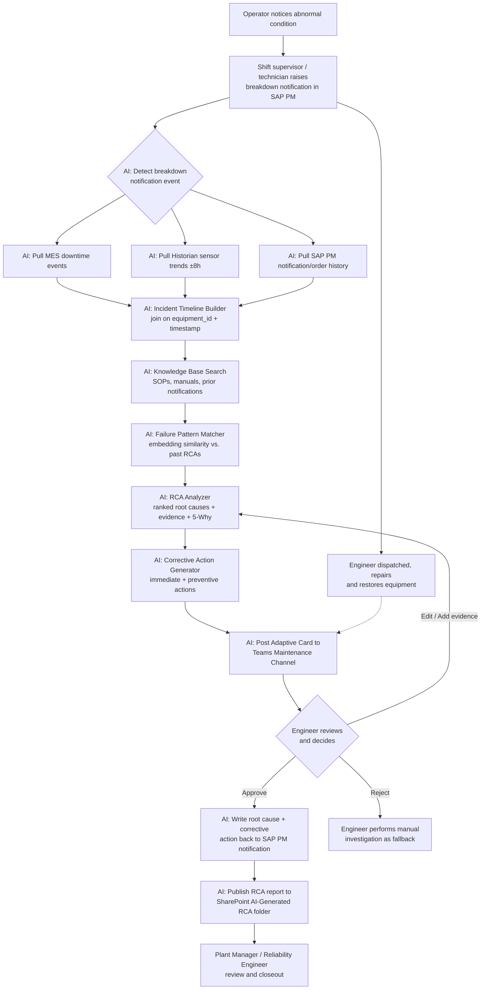

# Business Process — Breakdown Root Cause Analysis Copilot

## Current-State Process (Manual)

Today, when a critical asset breaks down, root cause investigation is a manual, single-threaded effort performed by one maintenance engineer, usually starting only after the line is already back up and running. The engineer works from memory and whatever screenshots or notes were captured in the heat of the moment, then backfills the formal record over the following hours or days.

1. Operator notices the abnormal condition or stoppage and calls the shift supervisor; a verbal description of symptoms is passed along informally (often via radio or a Teams message with no structure).
2. Shift supervisor or technician raises a breakdown notification in SAP PM, typically with a short free-text description and an approximate malfunction start time (frequently rounded to the nearest 15–30 minutes from memory).
3. Maintenance engineer is dispatched, restores the equipment to running condition, and only afterward begins the investigation.
4. Engineer manually queries SAP PM for the equipment's notification and work order history, looking for repeat failures on the same functional location.
5. Engineer separately logs into the MES to pull downtime events and reason codes for the affected line, manually cross-referencing timestamps against the SAP notification.
6. Engineer separately logs into the Historian client (e.g., PI Vision, AVEVA Historian client) to eyeball trend charts for relevant tags (vibration, temperature, pressure, flow) around the estimated failure window, often guessing at which tags matter.
7. Engineer searches SharePoint (or, more often, personal folders and email) for the equipment's OEM manual and any past RCA reports on the same or similar equipment — this step is frequently skipped entirely due to time pressure.
8. Engineer interviews the operator and shift supervisor after the fact, when recollection has already degraded.
9. Engineer manually assembles a timeline in a spreadsheet or Word document, reconciling inconsistent timestamps across the three source systems by hand.
10. Engineer forms a root cause hypothesis based on incomplete data and personal experience, without a structured way to check it against comparable historical breakdowns.
11. Engineer drafts a corrective action recommendation and, if the breakdown is significant enough, a formal RCA report for management review — this step can take days and is often the first thing deprioritized when the next breakdown occurs.
12. RCA report, if completed, is filed in SharePoint but rarely tagged or indexed in a way that makes it discoverable for the *next* similar breakdown.

## Pain Points
- **Data fragmentation:** Evidence needed for root cause determination is spread across SAP PM, MES, Historian, SharePoint, and informal chat — no single system has the full picture.
- **Time pressure destroys evidence quality:** Investigation typically starts after restart, so transient sensor conditions and operator recollection have already degraded by the time anyone looks.
- **Timestamp reconciliation is manual and error-prone:** Each system times its own events (notification creation time, MES downtime start/end, historian sensor timestamps) and engineers reconcile these by hand, introducing errors in the reconstructed sequence.
- **Tribal knowledge dependency:** Whether a similar failure happened before, and what fixed it, depends entirely on whether the investigating engineer personally remembers it or happens to search for it.
- **Inconsistent RCA quality and depth:** Because assembly is manual and time-consuming, RCA depth varies enormously by how busy the engineer is that week, not by the severity of the failure.
- **Repeat breakdowns:** Root cause misses (treating a symptom instead of the underlying cause) go undetected because there is no systematic way to link today's breakdown to past breakdowns with the same signature.
- **Delayed management visibility:** Plant managers often only see a completed RCA report days after the event, too late to influence near-term production or spares decisions.

## Future-State Process (With AI Assistant)

The Breakdown Investigation Copilot is inserted immediately after breakdown notification creation, running the multi-source data collection and analysis in parallel with — not after — the repair itself, so the engineer has a reviewable draft investigation by the time the equipment is back up.

1. Operator notices the abnormal condition and notifies the shift supervisor as today (this human step is unchanged).
2. Shift supervisor or technician raises a breakdown notification in SAP PM with equipment ID, malfunction start time, and short description (unchanged; this remains the trigger event).
3. **[AI]** The Copilot detects the new breakdown notification (via SAP PM event/change-pointer feed) and automatically pulls MES downtime events, Historian sensor trends, and SAP PM notification/order history for the equipment across a ±8-hour window (configurable) around the malfunction start time.
4. **[AI]** The Copilot's Incident Timeline Builder joins all three sources on `equipment_id` and timestamp into a single ordered timeline, explicitly flagging any interval where a source system had no data rather than assuming normal operation.
5. Maintenance engineer proceeds with physical repair and equipment restoration in parallel (unchanged), while the Copilot works in the background.
6. **[AI]** The Copilot's Knowledge Base Search retrieves the equipment's OEM manual, applicable SOPs, and any prior notifications/work orders for the same functional location from SharePoint and SAP PM.
7. **[AI]** The Copilot's Failure Pattern Matcher runs an embedding-based similarity search against the historical RCA report vector index to surface comparable past breakdowns on this or similar equipment.
8. **[AI]** The Copilot's RCA Analyzer performs LLM-based causal reasoning over the timeline, sensor trend, and matched historical cases, producing a ranked list of probable root causes with confidence levels and evidence citations, plus an optional 5-Why breakdown.
9. **[AI]** The Copilot's Corrective Action Generator drafts immediate containment actions and a longer-term preventive corrective action tied to the top-ranked root cause.
10. **[AI]** The Copilot posts an Adaptive Card summary (timeline, ranked root causes, draft corrective actions) into the Plant Maintenance Teams channel, tagging the responsible maintenance engineer for review.
11. Maintenance engineer reviews the draft, edits or reprioritizes the root cause ranking if needed, adds any information the Copilot could not access (e.g., a conversation with the operator), and approves or rejects via the Teams card.
12. **[AI]** On approval, the Copilot writes the final root cause and corrective action back to the SAP PM notification/work order as a completion note, and publishes the formatted RCA report to the "AI-Generated RCA Reports" SharePoint subfolder for the plant manager and reliability engineer to review, tagged and indexed for future similarity search.
13. Plant Manager / Reliability Engineer reviews the published RCA report and closes out any follow-up preventive maintenance actions (unchanged human decision).

## Process Flow Diagram

## RACI — Future-State Process

| Step | Technician | Maintenance Engineer | Planner | Plant Manager | AI Assistant |
|---|---|---|---|---|---|
| Raise breakdown notification | R | C | I | I | I |
| Multi-source data collection (MES/Historian/SAP PM) | I | A | I | I | R |
| Incident timeline reconstruction | I | A | I | I | R |
| Knowledge base / historical RCA search | I | C | I | I | R |
| Root cause ranking & evidence generation | I | A | I | I | R |
| Corrective action drafting | I | A | C | I | R |
| Review, correct, and approve AI draft | I | R/A | C | I | C |
| Write-back to SAP PM notification/work order | I | A | I | I | R |
| Publish final RCA report | I | A | I | C | R |
| RCA report review and preventive action closeout | I | C | C | R/A | I |

*R = Responsible, A = Accountable, C = Consulted, I = Informed.*

## Success Metrics / KPIs

Illustrative baseline ranges below are industry-typical benchmarks for discrete/process manufacturing plants without an AI-assisted RCA capability, not client-specific measurements. Targets assume a mature deployment after the pilot period defined in the Implementation Guide.

| KPI | Illustrative Baseline (Manual Process) | Target (With AI Copilot) |
|---|---|---|
| Time to first RCA draft available | 4–8 engineer-hours, often 1–3 days after the event | Under 15 minutes from breakdown notification creation |
| Mean Time To Repair (MTTR) for breakdowns with ambiguous cause | 2–4x the MTTR of clear-cause breakdowns | Reduced to within 1.3–1.5x of clear-cause MTTR |
| % of breakdowns with a completed, evidence-backed RCA report | 30–50% (many breakdowns never get a formal RCA) | 90%+ of Priority 1/2 breakdowns |
| Repeat breakdown rate (same equipment, same failure mode within 90 days) | 30–40% of breakdowns are repeats of an unresolved root cause | Reduced by 25–35% relative to baseline |
| Mean Time Between Failures (MTBF) on RCA-covered critical assets | Plant/asset-class baseline | 10–20% improvement within 12 months of sustained corrective action follow-through |
| Engineer hours spent on evidence-gathering per breakdown | 2–5 hours | Under 30 minutes (review and correction only) |
