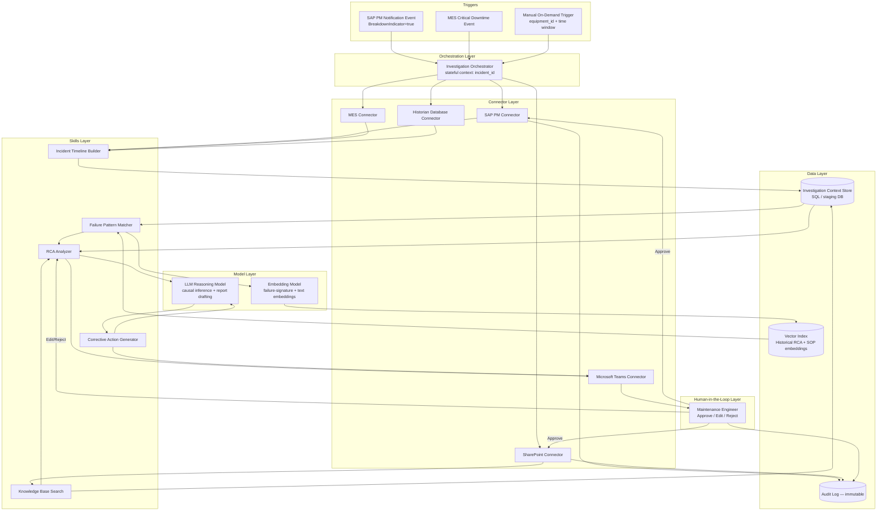

# Technical Design — Breakdown Root Cause Analysis Copilot

## Architecture Overview

The Breakdown Investigation Copilot is an event-triggered, multi-agent orchestration built around three data-source connectors (SAP PM, MES, Historian Database) that feed a timeline reconstruction stage, a knowledge-grounding stage (SharePoint RAG + historical failure-signature similarity search), and an LLM-based causal reasoning stage, with all output routed through a human-in-the-loop gate in Microsoft Teams before any write-back. The design deliberately separates **deterministic data joining** (timeline reconstruction — a rules-based ETL step, not an LLM task) from **probabilistic reasoning** (root cause ranking — an LLM task grounded in the deterministic timeline and retrieved evidence), so that the parts of the pipeline that must be exactly correct (what happened when) are never left to model inference, while the parts that require judgment (why it happened) are handled by an LLM with mandatory citation back to the deterministic layer.

The orchestration layer runs as a set of chained skills invoked by an event listener on SAP PM's change-pointer/notification feed (or a manual on-demand trigger). Each skill is stateless and idempotent, reading from and writing to a shared "investigation context" object keyed by `incident_id`, so a partially completed investigation (e.g., Historian temporarily unavailable) can be resumed or re-run without duplicating work.

## Architecture Diagram

## Component Breakdown

| Layer | Component | Responsibility |
|---|---|---|
| Orchestration | Investigation Orchestrator | Listens for triggers, initializes/resumes the investigation context, sequences skill calls, applies retry/fallback logic, enforces the human-approval gate before any write-back call. |
| Skills | Incident Timeline Builder | Deterministic join of SAP PM, MES, and Historian records into one ordered timeline; flags data gaps. |
| Skills | Knowledge Base Search | Retrieves SOPs, OEM manuals, and prior notification/work order history grounding the investigation. |
| Skills | Failure Pattern Matcher | Embedding-based similarity search against the historical RCA/failure-signature vector index. |
| Skills | RCA Analyzer | LLM causal reasoning producing the ranked, cited root cause list and 5-Why analysis. |
| Skills | Corrective Action Generator | Drafts immediate and preventive corrective actions and assembles the management RCA report. |
| Connectors | SAP PM, MES, Historian Database, SharePoint, Microsoft Teams | Per canonical Shared-Library specs; see Connector Integration Summary below. |
| Data Layer | Investigation Context Store | SQL staging table holding the assembled timeline, retrieved evidence, and draft outputs per `incident_id`, so downstream skills and human review share one consistent state. |
| Data Layer | Vector Index | Embeddings of historical RCA reports, SOPs, and failure descriptions, refreshed on SharePoint document change webhook. |
| Data Layer | Audit Log | Immutable record of every read used as evidence and every write-back action, with actor, timestamp, and payload hash. |
| Model Layer | Embedding Model | Generates vector representations of failure descriptions/sensor signatures for similarity search. |
| Model Layer | LLM Reasoning Model | Performs causal reasoning, 5-Why generation, corrective action drafting, and report writing — always constrained to cite the Investigation Context Store. |
| Human-in-the-Loop | Maintenance Engineer (via Teams) | Reviews, edits, approves, or rejects every draft before any system write-back occurs. |

## Data Flow

1. **Trigger:** SAP PM raises a change-pointer/event on notification creation where `BreakdownIndicator = true` (or MES raises a downtime event exceeding the configured critical-duration threshold, e.g., >30 minutes on a Priority-1 line). The Orchestrator creates an `incident_id` and investigation context.
2. **Multi-source retrieval:** The Orchestrator calls the SAP PM connector (`API_MAINTNOTIFICATION`, equipment master, and prior order/notification history for the same Functional Location), the MES connector (downtime events, shift/operator log, quality events for the line/equipment across the default ±8-hour window), and the Historian Database connector (recorded/interpolated tag values for the equipment's mapped tag list across the same window).
3. **Timeline reconstruction:** The Incident Timeline Builder joins all retrieved records on `equipment_id` + timestamp into a single time-ordered sequence, resolving each source's native timestamp to UTC, and inserts explicit `data_gap = true` markers for any 15-minute interval with no MES or Historian coverage. The reconstructed timeline is persisted to the Investigation Context Store.
4. **Knowledge grounding:** Knowledge Base Search queries SharePoint (Graph Search API + vector index) for the equipment's SOP, OEM manual, and any open/historical SAP PM notifications on the same Functional Location; results are added to the context store.
5. **Historical pattern matching:** Failure Pattern Matcher generates an embedding of the current incident's failure signature (a structured concatenation of equipment type, MES reason code, key sensor trend deltas, and free-text description) and queries the vector index for the top-N most similar historical RCA reports, returning each with a similarity score and the historical report's stated root cause.
6. **Causal reasoning:** RCA Analyzer receives the full context (timeline, SOP/manual excerpts, top similar historical cases) and prompts the LLM Reasoning Model to produce a ranked list of probable root causes, each with a confidence level and an explicit citation to a timeline entry, sensor tag/timestamp, or historical report ID. No hypothesis may be emitted without at least one citation — this is enforced by a structured-output schema that requires an `evidence_refs` array per hypothesis, validated before the result is accepted.
7. **Corrective action drafting:** Corrective Action Generator takes the top-ranked root cause(s) and drafts an immediate containment action and preventive corrective action, plus assembles the full RCA report (summary, timeline excerpt, ranked causes, corrective actions, evidence appendix) using the standard report template.
8. **Human review:** The Orchestrator posts an Adaptive Card summary to the plant's Maintenance Teams channel via the Microsoft Teams connector, tagging the responsible engineer, with Approve / Edit-Add-Evidence / Reject actions.
9. **Write-back (post-approval only):** On Approve, the Orchestrator calls the SAP PM connector to append the approved root cause and corrective action as a completion note on the notification/work order (idempotent via `X-Request-ID`), and calls the SharePoint connector to publish the finalized RCA report into the "AI-Generated RCA Reports" subfolder, tagged with `IncidentID`, `Equipment`, and `RootCauseCategory` metadata so it becomes available to future Failure Pattern Matcher queries.
10. **Audit:** Every retrieval and every write-back is logged to the immutable Audit Log with actor (agent or human), timestamp, and payload hash.

## Model / AI Approach

The Copilot's AI approach is deliberately three-layered, matching a specific technique to each sub-problem rather than asking one model to do everything:

1. **Multi-source timeline reconstruction (deterministic join, not ML):** MES downtime events, Historian sensor trends, and SAP PM notifications are joined on the composite key `equipment_id + timestamp` (with a configurable tolerance window, default ±2 minutes, to account for clock-skew between systems). This is implemented as a rules-based ETL/join operation — explicitly not an LLM task — because the sequencing of "what happened when" must be exact and auditable. Any interval lacking MES or Historian coverage is flagged `data_gap = true` rather than interpolated, so downstream reasoning never treats silence as evidence of normal operation.

2. **Failure pattern matching (embedding-based similarity search):** Each historical RCA report in SharePoint is embedded (title, equipment type/model, failure description, and — where available — a numeric sensor-signature vector such as peak vibration amplitude, temperature rise rate, and time-to-failure from onset of abnormal trend) and stored in a vector index. A new incident's own failure signature is embedded the same way and compared via cosine similarity against the index, returning the top-N (default 5) most similar historical cases above a minimum similarity threshold (default 0.70). This surfaces "this looks like the bearing seizure we had on Pump P-208 in March" even when no human on shift remembers it.

3. **LLM-based causal reasoning with citation enforcement:** The RCA Analyzer prompts an LLM with (a) the deterministic timeline, (b) the retrieved SOP/manual excerpts, and (c) the top similar historical cases and their stated root causes, and requires a structured output: a ranked array of root-cause hypotheses, each with `confidence` (High/Medium/Low), `rationale`, and a non-empty `evidence_refs` array pointing to specific timeline entries (by timestamp/tag), SAP PM record IDs, or historical RCA report IDs. Outputs failing schema validation (e.g., a hypothesis with no evidence reference) are rejected and the reasoning step is retried with a stricter instruction before falling back to a "insufficient evidence — escalate to manual investigation" result. This is the guardrail against hallucinated root causes: the model may reason, but it may not assert a cause it cannot point to evidence for.

4. **Confidence discipline under partial data:** Per NFR-7, if either MES or Historian data is unavailable for the incident window, the RCA Analyzer prompt is instructed to cap any hypothesis at "Medium" confidence and to explicitly state which source was missing, rather than reasoning from SAP PM notification text alone as if it were complete.

## Skills Design

| Skill | Inputs | Processing Approach | Outputs | Key Failure Modes |
|---|---|---|---|---|
| Incident Timeline Builder | SAP PM notification/orders, MES downtime events, Historian tag values for `equipment_id` + window | Deterministic join on `equipment_id` + timestamp (±2 min tolerance); UTC normalization; gap detection | Ordered timeline array with `data_gap` flags | Tag-to-equipment mapping missing/stale; clock skew beyond tolerance producing false ordering |
| Knowledge Base Search | Equipment ID / model, functional location | Graph Search + vector retrieval over SharePoint SOP/manual/RCA libraries; SAP PM history query | Ranked list of relevant documents/records with excerpts | Sensitivity-label restrictions hiding relevant documents from the service account's effective scope |
| Failure Pattern Matcher | Failure signature (equipment type, reason code, sensor deltas, description) | Embedding generation + cosine similarity search against vector index; threshold filtering | Top-N similar historical cases with similarity score and stated root cause | Cold-start equipment/failure modes with <3 historical precedents yield low-confidence or empty matches |
| RCA Analyzer | Timeline, KB Search results, Pattern Matcher results | LLM structured-output reasoning with mandatory `evidence_refs`; schema validation and retry | Ranked root cause list (confidence + citations), 5-Why analysis | Schema-invalid output on first pass (auto-retried); over-confidence if partial-data cap is not correctly applied |
| Corrective Action Generator | Ranked root causes, equipment SOP/manual excerpts | LLM drafting constrained to reference the top-ranked cause(s) and applicable SOP steps | Immediate + preventive corrective actions; full RCA report draft | Generic/non-specific action text if SOP retrieval returned no equipment-specific procedure |

This use case's `Skills/` and `Connectors/` folders now follow Claude's real Agent Skills and MCP connector formats (`Skills/<skill-name>/SKILL.md`; `Connectors/<connector-name>/SPEC.md` + `mcp-server.json` + `tools.json`) rather than the earlier invented schema, so the canonical specs below are paired with a real, implementable MCP tool contract.

## Connector Integration Summary

| Connector | Canonical Spec | Access Mode in This Use Case | Key Objects Consumed |
|---|---|---|---|
| SAP PM | `Shared-Library/Connectors/SAP-PM.md` | Read (notifications, orders, equipment master, breakdown history); Write (notification completion note, scoped to `I_QMEL`/`I_AFVGD` write authorization) | Maintenance Notification, Maintenance Order, Equipment Master, Breakdown History |
| MES | `Shared-Library/Connectors/MES.md` | Read-only | Downtime Event, Production Order Execution, Shift/Operator Log, Quality Event |
| Historian Database | `Shared-Library/Connectors/Historian-Database.md` | Read-only | Tag Time-Series, Tag Metadata, Event Frames |
| SharePoint | `Shared-Library/Connectors/SharePoint.md` | Read (SOP/manual/RCA libraries); Write (publish to "AI-Generated RCA Reports" subfolder only) | SOP Library, OEM Manuals, RCA Reports |
| Microsoft Teams | `Shared-Library/Connectors/Microsoft-Teams.md` | Read/Write (Adaptive Card post + inbound action capture) | Channel Message, Adaptive Card Action |

## Security & Governance
- **Auth model:** Each connector authenticates per its canonical spec — OAuth 2.0 client-credentials for SAP PM/MES/SharePoint/Teams, Kerberos or OAuth for the Historian, all via dedicated, least-privilege service accounts (e.g., `SVC_AI_MAINT` for SAP PM).
- **Data residency:** All retrieved data and LLM/embedding calls remain within the customer's contracted enterprise boundary (customer Azure tenant or approved on-prem LLM gateway); no maintenance or sensor data is sent to a public, non-contracted model endpoint.
- **Audit logging:** Every read used as cited evidence and every write-back is logged immutably with actor, timestamp, and payload hash, satisfying NFR-6.
- **Human-in-the-loop gates:** No SAP PM write-back and no SharePoint publish occurs without an explicit engineer Approve action captured via the Teams Bot Framework activity handler and correlated to the `incident_id`.
- **Least-privilege write scope:** SAP PM write access is limited to notification/work-order completion-note fields; SharePoint write access is limited to the designated "AI-Generated RCA Reports" subfolder, always tagged `AI-Generated` for downstream governance visibility.

## Scalability & Performance Targets
- Support concurrent investigation of at least 10 simultaneous breakdown events across up to 10 production lines without SLA degradation.
- Timeline reconstruction (Step 3) completes within 90 seconds of all source retrievals returning for a default ±8-hour window.
- End-to-end draft delivery to Teams within 15 minutes of trigger for 95% of investigations (per NFR-1), scaling linearly with the configured time window up to a ±24-hour maximum.
- Vector index supports at least 5 years of accumulated historical RCA reports (assume ~500–2,000 reports per plant) with sub-second similarity query response.

## Error Handling & Fallback Strategy
- **Source unavailable:** If MES or Historian is unreachable, retry 3x with exponential backoff (consistent with each connector's canonical error-handling spec); if still unavailable, proceed with partial data, label the investigation "Partial Data — Historian Unavailable" (or MES, as applicable), and cap root cause confidence at Medium per NFR-7.
- **Schema-invalid LLM output:** Reject and retry once with a stricter instruction reiterating the mandatory `evidence_refs` requirement; on second failure, return "Insufficient evidence for automated root cause ranking — escalate to manual investigation" rather than forcing a low-quality answer.
- **No similar historical case found:** Failure Pattern Matcher returns an empty result set explicitly (not a forced low-similarity match); RCA Analyzer proceeds using only the timeline and KB Search evidence and notes the absence of historical precedent in the report.
- **Write-back failure:** SAP PM or SharePoint write failures are retried per the connectors' canonical retry policy (3x, exponential backoff); persistent failure escalates to the requesting engineer via Teams direct message and, if unacknowledged within 30 minutes, via Outlook email fallback.
- **Teams delivery failure:** Falls back to Outlook email delivery of the same Adaptive Card content in HTML form, per the Teams connector's canonical fallback behavior.
