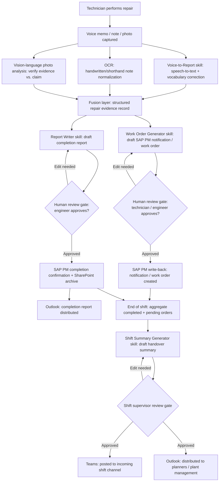

# Business Process: Maintenance Documentation & Work Order Assistant

## Current-State Process

Today, maintenance documentation is a manual, after-the-fact activity bolted onto the end of the actual repair work. A technician diagnoses and fixes an issue, then — sometimes immediately, often hours later at end of shift — has to reconstruct what happened well enough to type it into SAP PM, a shift log spreadsheet, or an email. Voice memos and photos taken in the moment (the most accurate record of what actually happened) are typically never transcribed or attached anywhere; they live and die on the technician's personal phone.

1. Technician receives or discovers a maintenance issue (via alarm, operator report, or PM round) and begins diagnosis and repair, often taking a phone photo of the fault or damage and occasionally recording a quick voice memo or jotting a note on a paper work order or tablet.
2. Technician completes the repair, replaces parts, and records labor hours informally (memory, scrap paper, or a personal notes app) — structured capture of parts and hours frequently happens later, from memory.
3. At a convenient point (end of task, end of shift, or the next morning), the technician manually opens SAP PM (or hands paper notes to a planner/clerk who does so) and types a notification and/or work order: equipment, functional location, short text, long text, priority.
4. The technician or a maintenance engineer separately writes a completion report or repair narrative, often duplicating information already typed into SAP, for compliance, warranty, or engineering-history purposes — commonly in a Word document or emailed narrative.
5. Photos taken during the repair are rarely attached to the SAP order or filed consistently in SharePoint; they remain on personal devices or a group chat, disconnected from the formal record.
6. At shift end, the outgoing shift supervisor or lead technician manually compiles a handover summary — usually a free-text email or a Teams message — listing what got done, what didn't, and anything the next shift needs to know, drawing on memory and whatever work orders happen to already be closed in SAP.
7. The incoming shift reads (or skims, or misses) the handover email/message and starts the shift, sometimes rediscovering open issues that were already known to the outgoing shift but not clearly documented.
8. Data quality issues (missing failure codes, missing parts/labor detail, inconsistent terminology) surface weeks later when planners or reliability engineers try to use the SAP data for MTBF/MTTR analysis or warranty claims, by which point the technician may not remember the details well enough to correct the record.

## Pain Points

- **Time lost to re-typing, not repairing.** Technicians spend a material share of paid time each shift converting notes/memory into SAP entries and reports rather than performing maintenance work, directly reducing wrench-time and schedule throughput.
- **Detail decay between the repair and the write-up.** The gap between doing the work and documenting it (minutes to hours, sometimes overnight) causes root cause, exact parts, and troubleshooting steps to be remembered imprecisely or omitted.
- **Voice and photo evidence is captured but never used.** Technicians already record the most accurate evidence of what happened (a photo of the failed part, a spoken description while still standing at the machine) but that evidence is disconnected from the formal record because transcribing and filing it is extra manual work nobody has time for.
- **Duplicate documentation effort.** The same repair gets described three times in three formats (SAP short/long text, a separate completion report, a shift handover note) with no reuse, multiplying the time cost and creating inconsistencies between the three versions.
- **Inconsistent, low-quality structured data in SAP.** Manually typed notifications and work orders frequently have inconsistent failure-mode coding, missing labor hours, or vague short text ("fixed pump"), which degrades downstream reliability analytics (MTBF/MTTR) and audit/warranty defensibility.
- **Shift handover quality depends on who happens to be writing it.** Handover completeness and clarity vary widely by shift lead, and there is no structured, auditable record of what was actually communicated at shift change.
- **No verification that claimed repairs match photo evidence.** Nothing today systematically checks that a photo attached to (or associated with) a work order actually shows the claimed part, failure, or completed repair — verification is manual and inconsistent, if it happens at all.

## Future-State Process

The AI assistant is inserted immediately after the technician finishes work (not at the end of the day), converting the voice memo, notes, and photos the technician already produces into a structured, reviewable draft within minutes, and again at shift end to compile the handover automatically from the shift's actual closed and open work orders.

1. Technician performs the repair as today, but captures the same voice memo, note, and photo(s) they would already take — no new capture behavior required, only routing them to the assistant (a dedicated Teams chat, a mobile upload, or an email-to-ingest inbox).
2. **Voice-to-Report skill** transcribes any voice recording into clean, punctuated text with maintenance-vocabulary correction (equipment names, part numbers, trade jargon); **OCR/note ingestion** normalizes any handwritten or shorthand text input into the same structured format.
3. **Vision-language photo analysis** reviews attached repair/damage photos against the transcribed/OCR'd note, checking that the visual evidence is consistent with the claimed failure mode and completed repair (e.g., a described "bearing replacement" photo actually shows a bearing), flagging any mismatch or insufficient evidence for human attention rather than silently accepting the claim.
4. **Work Order Generator skill** drafts a structured SAP PM notification and/or work order (equipment, functional location, failure mode, priority, short/long text) from the fused note+transcript+photo evidence, retrieving equipment master data from SAP PM to pre-populate known fields and reduce technician typing to a review-and-confirm action.
5. **Human review gate:** the technician or maintenance engineer reviews the drafted work order/notification in Teams (adaptive card) or a lightweight review UI, edits if needed, and approves — only then is it written back to SAP PM via the connector, with the original note/transcript/photo attached as supporting evidence in SharePoint.
6. On task completion, the **Report Writer skill** drafts the maintenance completion report / repair completion certificate (labor hours, parts consumed, root cause narrative, before/after photo references) from the same underlying evidence, again gated by human review before distribution via Outlook and archival in SharePoint.
7. At shift end, the **Shift Summary Generator skill** automatically pulls the shift's completed and pending work orders (from SAP PM) and notable events (from the shift's generated reports and technician notes) into a structured handover summary, which the outgoing shift supervisor reviews, edits if needed, and approves for delivery via Teams (to the incoming shift channel) and Outlook (to plant management/planners).
8. Incoming shift receives a consistent, structured handover (not a free-text email of variable quality) with direct links to the open work orders and their full evidence trail (notes, transcripts, photos) in SharePoint, reducing rediscovery time and repeat visits.
9. Reliability engineers and planners draw on consistently structured SAP data (failure codes, labor hours, parts) for MTBF/MTTR analysis and warranty/audit defense, with full traceability back to the originating technician input for every field.

## Process Flow Diagram

## RACI Table (Future-State Process)

| Activity | Technician | Maintenance Engineer | Planner | Plant Manager | AI Assistant |
|---|---|---|---|---|---|
| Capture voice/note/photo during repair | R/A | C | I | I | I |
| Transcribe voice, OCR notes, analyze photos | I | I | I | I | R/A |
| Draft SAP PM work order / notification | I | C | I | I | R/A |
| Review and approve work order before SAP write-back | A | R | C | I | R |
| Write back approved work order to SAP PM | I | I | I | I | R/A |
| Draft maintenance completion report | I | C | I | I | R/A |
| Review and approve completion report | C | A/R | I | I | R |
| Distribute completion report (Outlook/SharePoint) | I | A | I | C | R |
| Aggregate shift completed/pending orders and events | I | I | C | I | R/A |
| Draft shift handover summary | I | C | I | I | R/A |
| Review and approve shift handover summary | C | C | I | I | R |
| Distribute shift handover (Teams/Outlook) | I | I | I | I | R/A |
| Monitor documentation quality / data completeness KPIs | I | C | R | A | I |

## Success Metrics / KPIs

Baseline ranges below are illustrative industry-typical figures, clearly labeled as such — plant-specific baselines should be measured during Discovery (see Implementation Guide.md) before targets are finalized.

| KPI | Illustrative Baseline (Today) | Target (Post-Deployment) |
|---|---|---|
| Technician time spent on documentation per shift | 1–2 hours per 8-hour shift (15–25% of paid time) | Under 30 minutes per shift (under 6–8% of paid time) |
| Time from repair completion to SAP work order/notification closure | Same day to next day (often 4–24 hours) | Under 30 minutes (drafted immediately, approved same session) |
| SAP work orders missing key structured fields (labor hours, parts, failure code) | 20–30% of closed orders | Under 5% of closed orders |
| Shift handover completeness (open items correctly carried forward) | Variable, dependent on individual shift lead; no structured audit trail | 100% of open work orders auto-included with structured evidence links |
| Repeat visits attributable to incomplete handover or documentation | 10–15% of follow-up trips (industry benchmark) | Under 5% of follow-up trips |
| Photo evidence attached and traceable to the work order it supports | Inconsistent / rare in practice | 100% of photo-documented repairs linked to the SAP order and archived in SharePoint |
