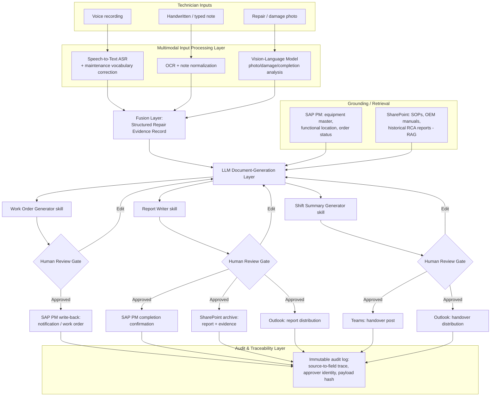

# Technical Design: Maintenance Documentation & Work Order Assistant

## Architecture Overview

The assistant is a multimodal input-processing and document-generation pipeline. It is deliberately not a diagnostic or predictive system: its job is to take the evidence a technician already produces — spoken words, handwritten notes, and photographs — and turn it into the structured documents the organization needs (SAP PM work orders, completion reports, shift handovers), with a human approval gate before anything is written back to a system of record or distributed externally.

Three input-processing capabilities run in parallel on submission: automatic speech recognition (ASR) on voice recordings, optical character recognition (OCR) on handwritten/typed notes, and vision-language model (VLM) analysis on repair photos. Their outputs are fused into a single structured "repair evidence record" that is then handed to an LLM document-generation layer. That layer drafts the target document type (work order/notification, completion report, or shift handover) using retrieval-augmented grounding against SAP PM master data and SharePoint SOPs/history, and always terminates at a human-in-the-loop review-and-approve step before any connector write-back or distribution occurs.

## Architecture Diagram

## Component Breakdown

The Skills and Connectors referenced throughout this document follow Claude's real Agent Skills and MCP formats (`SKILL.md` folders and MCP server/tool manifests) rather than the earlier invented, non-standard schema.

| Layer | Components | Role |
|---|---|---|
| Orchestration Layer | Workflow orchestrator (event-driven, per submission and per shift-end trigger) | Sequences ASR/OCR/VLM processing, fusion, LLM generation, review-gate routing, and connector write-back; maintains conversation/session state for multi-turn edits. |
| Skills | Report Writer, Voice-to-Report, Work Order Generator, Shift Summary Generator | Encapsulate the prompt templates, output schemas, and validation logic for each document type (see `Skills/report-writer/SKILL.md`, `Skills/voice-to-report/SKILL.md`, `Skills/work-order-generator/SKILL.md`, `Skills/shift-summary-generator/SKILL.md` — real Agent Skill folders per `SKILL-MD-SPEC.md`). |
| Connectors | SAP PM, SharePoint, Microsoft Teams, Outlook | Provide read (master data, RAG grounding, order status) and write (notifications, work orders, confirmations, files, messages, emails) access per the canonical Shared-Library specs, implemented as real MCP servers declared in `Connectors/sap-pm/`, `Connectors/sharepoint/`, `Connectors/microsoft-teams/`, and `Connectors/outlook/` (each with `SPEC.md`, `mcp-server.json`, and `tools.json` per `MCP-CONNECTOR-SPEC.md`). |
| Data Layer | Structured repair evidence records (transient), SAP PM staging extracts, SharePoint document/vector index | Holds the fused multimodal record during processing and the RAG index used for grounding. |
| Model Layer | ASR model, OCR model, VLM, generation LLM | Perform transcription, text extraction, photo consistency analysis, and structured document drafting respectively. |
| Human-in-the-Loop Layer | Teams adaptive-card review UI, escalation routing | Presents every draft for edit/approval; blocks all write-back/distribution paths until an explicit approval event is recorded. |

## Data Flow

1. Technician submits a voice recording, note (text/photo-of-handwriting), and/or repair photo(s) via the Teams-based submission channel (or mobile upload), tagged with a work order reference if one already exists, or left untagged for a new-issue flow.
2. The orchestrator routes each modality present in the submission to its processing model in parallel: voice → ASR, handwritten/typed note → OCR, photo(s) → VLM. Any modality absent is simply skipped (see NFR-8 graceful degradation).
3. The Fusion Layer merges ASR transcript, OCR text, and VLM assessment (object/damage/part identification plus a consistency confidence score against the claimed narrative) into a single structured repair evidence record, keyed to a work order reference (existing or newly generated) and equipment ID.
4. The orchestrator queries **SAP PM** (Equipment Master / Functional Location OData services) to resolve the technician-referenced equipment ID/nickname to canonical equipment and functional-location data, and queries recent **SAP PM** Maintenance Notification/Order records to check for likely duplicates (FR-15).
5. The orchestrator queries **SharePoint** (Graph Search API + vector index) for relevant SOP sections, OEM manual excerpts, or historical RCA reports for the identified equipment, to ground failure-mode terminology and completion-report language in approved documentation.
6. The fused evidence record plus SAP PM/SharePoint grounding context is passed to the LLM Document-Generation Layer, which invokes the appropriate skill (Work Order Generator for a new/updated notification or order; Report Writer for a completion report; Shift Summary Generator at shift-end) using the corresponding Prompt Library templates.
7. The drafted document, with inline source citations (which note/transcript segment/photo produced each field), is posted to **Microsoft Teams** as an adaptive card for the designated human reviewer (technician for a work-order draft on their own task, maintenance engineer for a completion report, shift supervisor for a handover summary).
8. On approval, the orchestrator executes the corresponding write-back: **SAP PM** OData POST/PATCH for a notification/work order or completion confirmation; **SharePoint** file upload for the archived report and source evidence (tagged `AI-Generated`); **Outlook** `sendMail` for formal report/handover distribution; **Microsoft Teams** channel post for the handover summary. On rejection/edit request, the draft returns to the LLM layer with reviewer comments for regeneration.
9. Every write-back and distribution action generates an audit log entry (agent identity, source record IDs, reviewer identity, timestamp, payload hash), stored per the SAP PM connector's audit pattern and made queryable for compliance/warranty defense.
10. At shift end, a scheduled trigger aggregates the shift's SAP PM order status (completed/pending) and the shift's generated reports/notable events into the shift handover draft, which follows the same review-gate-then-distribute pattern via Teams and Outlook.

## Model / AI Approach

This use case's AI approach is deliberately centered on **multimodal input processing feeding an LLM document-generation layer**, not on predictive or diagnostic modeling (those are covered by the Predictive Maintenance Assistant and Breakdown Root Cause Analysis Copilot use cases in this repository):

- **Speech-to-text (ASR):** A production-grade ASR model (e.g., Whisper-class or equivalent enterprise ASR service) fine-tuned or prompt-adapted with a maintenance-domain vocabulary list (equipment nicknames such as "Pump01," part numbers, trade jargon like "megger," "die cushion," "sheave") to reduce mis-transcription of domain terms that generic ASR models frequently garble. Runs with automatic punctuation and speaker-agnostic single-speaker assumption (one technician dictating).
- **OCR + handwriting normalization:** An OCR engine capable of both printed and cursive/print handwriting recognition, followed by an LLM-based normalization pass that corrects OCR artifacts and maps shorthand/abbreviations (e.g., "brg" → "bearing," "O/L trip" → "overload trip") into normalized text, without altering the technician's original meaning — the raw OCR output is retained alongside the normalized text for audit purposes.
- **Vision-language model (VLM) photo analysis:** A VLM analyzes submitted repair/damage photos to (a) identify visible components and their apparent condition (e.g., "pitted bearing outer race," "cracked elastomer coupling insert," "corroded connector pin") and (b) score consistency between what the photo shows and what the technician's note/transcript claims was found or repaired. Low-consistency or low-confidence results are surfaced to the human reviewer as an explicit flag rather than being silently resolved by the model choosing one version of the truth.
- **LLM document-generation layer:** A large language model, grounded via retrieval (RAG) against SAP PM equipment master data and SharePoint SOP/OEM/RCA content, drafts the target document using the fused multimodal evidence record. The model is instructed (see Prompt Library.md) to cite the specific source (note ID, transcript timestamp span, photo filename) for every substantive field it populates, and to explicitly mark any field for which it has low or no supporting evidence rather than inventing plausible-sounding detail.
- **Human-review gate (mandatory, non-bypassable):** No output of the LLM document-generation layer reaches SAP PM, Outlook, or a Teams channel post without an explicit approval action logged against a specific human reviewer identity. This is enforced at the orchestration layer, not merely as a UI convention — the connector write-back functions require an `approved_by` and `approval_timestamp` field populated from a recorded approval event.

## Skills Design

| Skill | Inputs | Processing Approach | Outputs | Key Failure Modes |
|---|---|---|---|---|
| Voice-to-Report | Voice recording (audio file), optional equipment/work-order context | ASR transcription → maintenance-vocabulary correction pass → structuring into note-record schema | Structured transcript record (work_order_ref, equipment_id if resolvable, technician_id, note_text, captured_at) | Poor audio quality causing low-confidence transcription (mitigated by explicit low-confidence flagging); misheard equipment nicknames (mitigated by fuzzy-matching against SAP equipment master before finalizing). |
| Report Writer | Structured repair evidence record (transcript + OCR text + VLM photo assessment) | RAG-grounded LLM drafting of completion report/certificate sections (summary, root cause narrative, labor/parts, evidence references) | Draft maintenance completion report / repair completion certificate with inline source citations | Fabricated detail if evidence is sparse (mitigated by explicit "insufficient evidence" field marking, never silent invention); inconsistent terminology vs. SOP language (mitigated by SharePoint RAG grounding). |
| Work Order Generator | Structured repair evidence record, SAP PM equipment master lookup, duplicate-check query | RAG-grounded LLM drafting of SAP PM notification/work-order fields, formatted to the SAP PM OData schema | Draft SAP PM notification/work order payload (equipment, functional location, failure mode, priority, short/long text) pending approval | Wrong equipment match from ambiguous nickname (mitigated by reviewer confirmation step); duplicate notification creation (mitigated by FR-15 duplicate-detection check). |
| Shift Summary Generator | SAP PM order status query (completed/pending for shift/plant), shift's generated reports and technician notes | Aggregation + LLM summarization into structured handover format, grouped by equipment/line with notable events highlighted | Draft shift handover summary (orders completed, orders pending, notable events, links to evidence) | Stale SAP data at generation time (mitigated by near-real-time query immediately before generation, not cached); omission of a verbally-passed issue never entered as a note (inherent input-completeness limitation, mitigated by supervisor review step). |

## Connector Integration Summary

| Connector | Access Mode | Objects Used | Canonical Spec |
|---|---|---|---|
| SAP PM | Read (equipment master, functional location, order/notification status) + Write (create/update notification, work order, completion confirmation) | Equipment Master, Functional Location, Maintenance Notification, Maintenance Order | `Shared-Library/Connectors/SAP-PM.md` |
| SharePoint | Read (SOPs, OEM manuals, historical RCA reports via RAG) + Write (archive generated reports and source evidence to an "AI-Generated" subfolder) | SOP Library, OEM Manuals, RCA Reports, Photo/Video Attachments | `Shared-Library/Connectors/SharePoint.md` |
| Microsoft Teams | Write (adaptive card review posts, handover channel posts) + Read (button-click/approval responses) | Channel Message, Adaptive Card Action, Direct Message | `Shared-Library/Connectors/Microsoft-Teams.md` |
| Outlook | Write (send completion reports, shift handover summaries, escalations) + optional Read (inbound note/photo ingestion via service mailbox) | Outbound Notification, Inbound Ingestion (optional), Distribution List | `Shared-Library/Connectors/Outlook.md` |

## Security & Governance

- **Auth model:** Each connector authenticates via its own least-privilege service principal per the canonical specs — SAP PM via OAuth 2.0 client-credentials against a dedicated `SVC_AI_MAINT`-class communication user restricted to notification/work-order transaction codes; SharePoint/Teams/Outlook via Azure AD app registrations scoped to specific sites/channels/mailboxes, not tenant-wide permissions.
- **Data residency:** No maintenance data, voice recordings, photos, or generated reports persist outside the enterprise's designated cloud/on-prem boundary except in short-lived, encrypted model-inference working memory, consistent with each connector's stated residency posture.
- **Audit logging:** Every write-back or distribution action (SAP PM write, SharePoint upload, Teams post, Outlook send) generates an immutable audit record: acting agent/skill, source evidence record IDs, human approver identity, timestamp, and payload hash.
- **Human-in-the-loop gates:** Enforced at the orchestration layer for all three document types (work order/notification, completion report, shift handover) — no exceptions, no "auto-approve" configuration is exposed in production.
- **Explainability:** Every generated field carries a source-trace pointer (note ID, transcript timestamp range, or photo filename), retrievable on demand by an auditor, satisfying NFR-6.
- **Content sensitivity:** SharePoint interactions respect existing sensitivity labels and Microsoft Purview DLP policies; generated reports inherit the sensitivity classification of the equipment/plant context they describe.

## Scalability & Performance Targets

- Support at least 50 concurrent technician submissions per plant during peak shift-change windows (NFR-10) without breaching the response-time targets below.
- Voice transcription: under 60 seconds for a 5-minute memo (NFR-1).
- End-to-end draft generation (submission to reviewable draft): under 2 minutes for a typical single-equipment repair record (NFR-2).
- Review-and-approval interface availability: 99.5% during scheduled operating shifts (NFR-3).
- Shift-summary generation: completes within 10 minutes of the shift-end trigger firing, to allow supervisor review before shift changeover.
- Horizontal scaling of the ASR/OCR/VLM processing layer is stateless per submission and can scale out with submission volume; the LLM document-generation layer is rate-limited per plant to stay within model-provider throughput quotas, with a queuing fallback (see Error Handling) rather than dropped requests.

## Error Handling & Fallback Strategy

- **Modality failure (ASR/OCR/VLM):** If a given modality fails to process (corrupt audio, illegible handwriting, unreadable photo), the orchestrator proceeds with the remaining available modalities and explicitly marks the affected fields as lacking that evidence source (NFR-8), rather than blocking generation or silently omitting the gap.
- **Connector write failures:** SAP PM, SharePoint, Teams, and Outlook write-backs each follow their canonical connector's retry policy (typically 3 attempts with exponential backoff); persistent failure escalates to a human-in-the-loop queue (SAP PM) or falls back to an alternate delivery channel (Outlook failure → Teams post; Teams failure → Outlook email; SharePoint upload failure → attach report directly to the notification email), consistent with the Shared-Library canonical specs.
- **Duplicate detection false positives/negatives:** The duplicate-check (FR-15) is advisory, not blocking — a flagged possible duplicate still requires reviewer confirmation before either merging or proceeding as a new record, ensuring a legitimate second issue is never silently suppressed.
- **Ambiguous equipment resolution:** If a technician's equipment reference cannot be confidently resolved to a single SAP PM equipment/functional-location record, the draft is generated with the field marked "unresolved — select equipment" and the top candidate matches presented to the reviewer, rather than guessing.
- **Model/version drift:** ASR, OCR, and VLM model versions are logged per NFR-9; a material accuracy regression detected in ongoing monitoring triggers a rollback to the last validated model version and a reprocessing pass over affected recent submissions if warranted.
