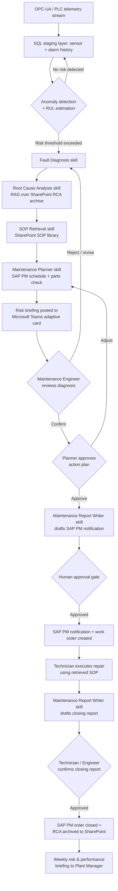

# Business Process — Predictive Maintenance Assistant

## Current-State Process (Manual, Reactive)

Today, most maintenance organizations detect problems only after equipment behavior has already degraded to the point of an alarm, an operator complaint, or an outright stoppage. Diagnosis, scheduling, and reporting are manual, sequential, and dependent on the tacit knowledge of whichever technician or engineer happens to be on shift.

**Narrative:** An operator or a PLC-driven alarm signals abnormal behavior — a pump running hot, a motor drawing high current, a conveyor bearing making noise. A technician is dispatched to investigate. If the technician cannot immediately identify the cause, they escalate to a maintenance engineer, who may need to pull historical readings manually from the historian, search for the equipment's SOP folder on a shared drive or SharePoint site, or recall a similar past failure from memory or paper logs. Once a probable cause is identified, someone manually writes up a SAP PM notification, and a planner schedules the repair — competing with other planned work and dependent on spare parts availability that has not yet been checked. After the repair, someone (often days later, under time pressure to move to the next job) writes a closing report, and the root cause and resolution are rarely fed back systematically into a searchable knowledge base.

**Current-State Steps:**
1. Equipment exhibits abnormal behavior (noise, heat, vibration, output degradation) or a PLC/SCADA alarm fires.
2. Operator or technician notices the issue, often after production impact has already begun.
3. Technician manually checks the equipment locally (visual/audible inspection); if unresolved, escalates to a maintenance engineer.
4. Engineer manually queries the historian or SQL staging tables (if access and know-how permit) to review recent sensor trends.
5. Engineer searches SharePoint or shared drives for the relevant SOP, OEM manual, or a comparable past RCA report — frequently without a reliable index or search.
6. Engineer or technician forms a hypothesis on root cause based on experience and available (often incomplete) data.
7. A maintenance notification is manually typed into SAP PM, with inconsistent detail depending on who writes it.
8. A planner schedules a work order, manually checking crew availability and (separately) whether spare parts are in stock — frequently discovering parts gaps only at execution time.
9. Repair is executed, often as unplanned/emergency work displacing already-scheduled planned maintenance.
10. Closing documentation (notification completion, cost, downtime hours) is entered manually, often abbreviated due to time pressure.
11. Root cause and resolution knowledge remains largely undocumented or unsearchable for future incidents, so the same diagnostic effort is frequently repeated.

## Pain Points

- **Detection lag:** Issues are identified only once symptoms are already severe (audible, visible, or alarm-triggered), eliminating the lead time needed for planned intervention.
- **Diagnostic dependency on tenure:** Root cause identification depends heavily on individual technician/engineer experience; less-tenured staff take longer and make more misdiagnoses.
- **Fragmented data access:** Sensor history (Historian/SQL), maintenance history (SAP PM), and documentation (SharePoint) live in separate systems with no unified view, so cross-referencing them is slow and manual.
- **Inconsistent documentation quality:** Notification and closing-report quality varies by author, hampering both SAP PM data integrity and future RCA/trend analysis.
- **Reactive scheduling collisions:** Emergency repairs displace planned preventive maintenance, degrading schedule compliance and compounding the reactive cycle.
- **Lost institutional knowledge:** Root cause insights from past incidents are rarely captured in a form that is easy to retrieve during the next similar event.
- **Delayed, inconsistent stakeholder communication:** Plant managers and shift supervisors typically learn of a failure's business impact after downtime has already accrued.

## Future-State Process (AI-Assisted)

**Narrative:** The Predictive Maintenance Assistant continuously monitors OPC-UA/PLC telemetry and SQL-staged historical data for every equipment asset in scope. Statistical and machine-learning models flag early-stage anomalies and estimate remaining useful life well before symptoms become perceptible to an operator. When a risk signal crosses a defined threshold, the assistant automatically runs Fault Diagnosis and Root Cause Analysis, retrieves the relevant SOP section, and generates a draft SAP PM notification and a recommended maintenance action plan — all delivered as a structured Teams adaptive card to the responsible technician/engineer and planner for review. Humans remain the decision-makers: they approve, adjust, or reject the recommendation before anything writes back to SAP PM. Once work is completed, the assistant drafts the closing report from technician input and structured data, keeping SAP PM records complete and consistent, and files the incident's diagnostic trail into the SharePoint RCA archive so it strengthens future retrieval.

**Future-State Steps:**
1. Continuous anomaly detection and RUL estimation run against live OPC-UA telemetry and SQL-staged historical data for all in-scope equipment (**AI Assistant**).
2. When a risk signal crosses threshold, the assistant runs Fault Diagnosis to produce a ranked list of probable failure modes with confidence scores (**AI Assistant**).
3. The assistant runs Root Cause Analysis, retrieving comparable historical RCA reports and OEM guidance from SharePoint via RAG (**AI Assistant**).
4. The assistant runs SOP Retrieval to surface the exact procedure/checklist section relevant to the diagnosed fault (**AI Assistant**).
5. The assistant runs Maintenance Planner to propose an action window, crew, and parts check against existing PM schedules (**AI Assistant**).
6. A structured risk briefing (equipment, predicted failure window, confidence, root cause hypothesis, SOP reference, recommended plan) is posted to the Maintenance Teams channel as an adaptive card (**AI Assistant → Technician / Maintenance Engineer**).
7. The Maintenance Engineer reviews the diagnosis and either confirms, edits, or rejects it, adding field observations the model could not see (**Maintenance Engineer**).
8. The Planner reviews the proposed action plan against real crew/parts constraints and approves scheduling (**Planner**).
9. On approval, the assistant drafts and — after explicit human approval — submits the SAP PM notification and work order text (**AI Assistant → Technician**, approval by **Maintenance Engineer**).
10. The Technician executes the planned repair using the retrieved SOP as reference (**Technician**).
11. The assistant drafts the closing maintenance report (downtime, cost, root cause, resolution) from technician input and structured order data; the Technician/Engineer reviews and confirms before it is written back to SAP PM and archived to SharePoint (**AI Assistant → Technician / Maintenance Engineer**).
12. The Plant Manager receives a summarized weekly risk and performance briefing via Outlook/Teams reflecting avoided downtime and open risk items (**AI Assistant → Plant Manager**).

## Process Flow Diagram

## RACI Table (Future-State Process)

| Activity | Technician | Maintenance Engineer | Planner | Plant Manager | AI Assistant |
|---|---|---|---|---|---|
| Continuous anomaly detection / RUL estimation | I | I | I | I | R/A |
| Fault diagnosis and ranked failure-mode output | I | C | I | I | R/A |
| Root cause analysis (RAG over RCA archive) | I | A | I | I | R |
| SOP retrieval for diagnosed fault | R (uses SOP) | C | I | I | R |
| Maintenance action plan (schedule, crew, parts) | I | C | A | I | R |
| Risk briefing delivery (Teams/Outlook) | I | I | I | I | R |
| Confirm/revise diagnosis with field observation | C | A/R | I | I | C |
| Approve action plan and scheduling | I | C | A/R | I | C |
| Draft SAP PM notification / work order text | I | A | C | I | R |
| Human approval of SAP PM write-back | I | A | R | I | C |
| Execute repair per SOP | R/A | C | I | I | I |
| Draft closing maintenance report | C | A | I | I | R |
| Confirm closing report and SAP PM closure | R | A | I | I | C |
| Weekly risk & performance briefing | I | I | I | A/R (recipient) | R |

*R = Responsible, A = Accountable, C = Consulted, I = Informed.*

## Success Metrics / KPIs

| KPI | Illustrative Industry Baseline (Reactive) | Illustrative Target (AI-Assisted) | Notes |
|---|---|---|---|
| Unplanned downtime (% of available production time) | 15–25% | 5–8% | Directional industry benchmark; validate against plant OEE data. |
| MTTR (Mean Time to Repair) | 4–8 hours per breakdown event | 2–4 hours | Faster diagnosis and pre-staged parts/SOP reduce repair time. |
| MTBF (Mean Time Between Failures) — critical rotating assets | Baseline per asset class | +20–35% improvement | Early intervention on degrading assets extends effective service life. |
| PM schedule compliance | 60–75% | 85–95% | Fewer emergency repairs displacing planned PM work. |
| Failure prediction lead time | 0 (reactive) | 48–120 hours advance warning | Enables planned parts sourcing and crew scheduling. |
| Notification/report documentation completeness | Variable, often <60% of fields populated | >95% | AI-drafted text plus human review standardizes completeness. |
| Mean diagnostic time-to-hypothesis | 1–3 hours (experience-dependent) | <15 minutes | Assistant surfaces ranked hypotheses immediately on risk detection. |

*Baselines and targets are illustrative, industry-typical ranges intended for planning purposes; they should be recalibrated against the specific plant's historical OEE, MTTR, and MTBF data during Discovery.*
