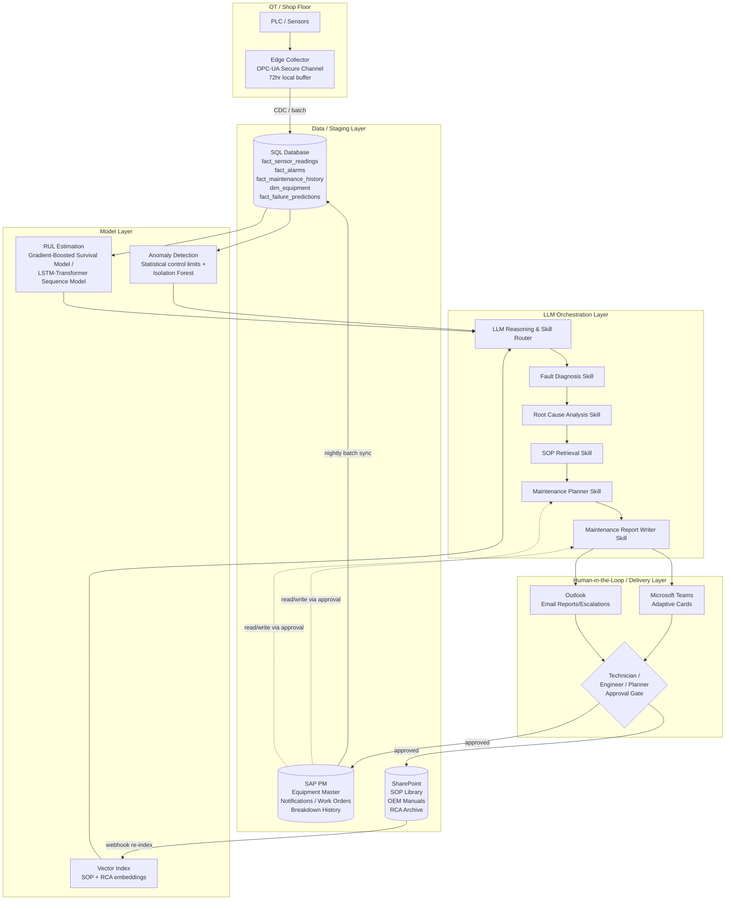

# Technical Design — Predictive Maintenance Assistant

## Architecture Overview

The Predictive Maintenance Assistant is a layered architecture consisting of: (1) an edge/OT ingestion layer that reads shop-floor telemetry without ever writing back to control systems; (2) a SQL-based analytics/staging layer that consolidates telemetry, alarms, and maintenance history into model-ready tables; (3) a model layer combining statistical/ML anomaly detection with RUL survival/sequence models; (4) an LLM orchestration layer that sequences the five skills (Fault Diagnosis, Root Cause Analysis, Maintenance Planner, SOP Retrieval, Maintenance Report Writer), grounding its reasoning in retrieved structured data and RAG over SharePoint documents; and (5) a human-in-the-loop delivery/approval layer built on Microsoft Teams and Outlook, with all system-of-record write-back routed through SAP PM only after explicit human sign-off.

The design deliberately keeps the model layer's outputs (anomaly scores, RUL estimates, ranked failure modes) as structured, versioned, auditable artifacts that the LLM orchestration layer consumes as tool outputs — the LLM does not itself perform time-series inference; it reasons over the outputs of purpose-built statistical/ML models and retrieved documents, which materially reduces hallucination risk and keeps the numerically sensitive parts of the pipeline in interpretable, testable model code.

## Architecture Diagram

## Component Breakdown

| Layer | Component | Responsibility |
|---|---|---|
| Orchestration | LLM Reasoning & Skill Router | Interprets model outputs, sequences the five skills, generates natural-language explanations, cites sources, and defers write actions to the approval gate. |
| Skills | Fault Diagnosis, Root Cause Analysis, Maintenance Planner, SOP Retrieval, Maintenance Report Writer | Purpose-built reasoning routines defined in `Skills/`; each takes structured/retrieved inputs and produces a structured, human-reviewable output. |
| Connectors | SAP PM, SQL Database, OPC-UA/PLC, SharePoint, Microsoft Teams, Outlook | Integration adapters defined in `Connectors/`, each scoped to least-privilege access per the canonical Shared-Library specs. |
| Data Layer | SQL staging tables (`fact_sensor_readings`, `fact_alarms`, `fact_maintenance_history`, `dim_equipment`, `fact_failure_predictions`) | Query-optimized, model-ready consolidation of OT and SAP data; sole read path for the model layer. |
| Model Layer | Anomaly detection models, RUL estimators, embedding/vector index | Produces the quantitative risk signals (anomaly scores, RUL, confidence intervals) and the semantic retrieval index consumed by the orchestration layer. |
| Human-in-the-Loop Layer | Teams adaptive cards, Outlook notifications, approval gate | Presents recommendations for review, captures human decisions, and is the only path through which SAP PM/SharePoint write-backs occur. |

`Skills/` and `Connectors/` now follow Claude's real Agent Skills and MCP connector formats (a `SKILL.md`-per-folder skill structure and a `SPEC.md` + `mcp-server.json` + `tools.json` per-folder connector structure), not the earlier flat narrative `.md` files.

## Data Flow

1. **Telemetry capture:** The OPC-UA/PLC connector's edge collector subscribes to vibration, temperature, current, pressure, and digital alarm tags per `Connectors/opc-ua-plc/SPEC.md`, buffering up to 72 hours locally and forwarding via CDC to `fact_sensor_readings` and `fact_alarms` in the SQL Database.
2. **Master data enrichment:** SAP PM equipment master (criticality class, functional location, install date) is synced nightly into `dim_equipment`, and historical notifications/work orders into `fact_maintenance_history`, per `Connectors/sap-pm/SPEC.md`.
3. **Feature computation:** A scheduled feature pipeline computes rolling statistics (mean, RMS, kurtosis, rate-of-change) per equipment/metric from `fact_sensor_readings`, feeding both the anomaly detection and RUL models.
4. **Anomaly scoring:** Statistical control-limit checks (per-metric, per-equipment-class Shewhart/EWMA-style limits) and an Isolation Forest model trained per equipment class produce a composite anomaly score, written to `fact_failure_predictions` alongside model_version.
5. **RUL estimation:** For equipment with sufficient run-to-failure or censored history, a gradient-boosted survival model (e.g., XGBoost-AFT/Cox) or, for equipment with dense multivariate time-series history, an LSTM/transformer-based sequence-to-RUL estimator produces a remaining-useful-life estimate with a confidence interval.
6. **Threshold evaluation:** When composite anomaly score or RUL confidence interval breaches configured thresholds (see the Configuration Reference in `Plugin/PLUGIN_GUIDE.md`, with defaults also documented in `Implementation Guide.md`), the orchestration layer is triggered.
7. **Skill sequencing:** The LLM orchestration layer invokes Fault Diagnosis (ranks probable failure modes using anomaly signatures + historical fault correlation), then Root Cause Analysis (RAG query against the SharePoint-backed vector index for comparable RCA reports/OEM guidance), then SOP Retrieval (RAG query for the applicable procedure section), then Maintenance Planner (reads SAP PM PM schedule and crew/parts data), then Maintenance Report Writer (drafts notification/report text).
8. **Delivery:** The composed risk briefing is posted to Microsoft Teams as an adaptive card per `Connectors/microsoft-teams/SPEC.md`, with Outlook as the fallback/escalation channel per `Connectors/outlook/SPEC.md`.
9. **Human decision capture:** Approve/reject/edit actions on the adaptive card are captured by the Teams Bot Framework handler and logged; only "Approved" actions proceed to SAP PM write-back.
10. **Write-back and archival:** Approved notifications/work orders are written to SAP PM via OData POST/PATCH with idempotency keys; the finalized diagnostic trail (evidence, diagnosis, root cause, resolution) is written to the SharePoint RCA archive, tagged `AI-Generated` pending any required editorial review policy.
11. **Feedback loop:** Closed work order outcomes (actual failure mode confirmed, downtime, cost) flow back into `fact_maintenance_history` and are used in scheduled model retraining/recalibration cycles.

## Model / AI Approach

The AI approach is deliberately hybrid — quantitative time-series models handle numerically sensitive detection/estimation, and the LLM handles reasoning, synthesis, and natural-language orchestration over their outputs plus retrieved text.

**1. Anomaly Detection (early-warning layer).**
- Per-metric statistical control limits (EWMA/Shewhart-style, computed per equipment class and operating regime — e.g., separate limits for a pump running at full load vs. reduced throughput) flag first-order deviations with minimal false positives on stable, well-characterized signals.
- An Isolation Forest model, trained per equipment class on multivariate feature vectors (vibration RMS/kurtosis, temperature, current draw, rate-of-change features), flags multivariate anomalies that univariate control limits miss — e.g., a combination of moderately elevated vibration and moderately elevated temperature that is individually within limits but jointly anomalous.
- Output: a composite anomaly score (0–1) per equipment per scoring cycle, plus the contributing metric(s), stored in `fact_failure_predictions`.

**2. Remaining-Useful-Life (RUL) Estimation.**
- For equipment classes with adequate run-to-failure or right-censored history (e.g., bearing-dependent pumps and motors with several years of breakdown history in SAP PM), a **gradient-boosted survival model** (XGBoost with Accelerated Failure Time or Cox proportional-hazards objective) estimates probability of failure within defined future windows (48h/7d/30d), trained on engineered features from vibration/temperature/current trends plus runtime hours since last overhaul.
- For equipment classes with dense, regularly sampled multivariate telemetry and enough labeled degradation-to-failure sequences, an **LSTM or transformer-based sequence-to-RUL model** directly regresses remaining useful life (in operating hours) from a rolling window of raw/lightly-featurized sensor sequences, producing a point estimate with a bootstrapped or quantile-regression confidence interval.
- Model selection per equipment class is a configuration choice (see the Configuration Reference in `Plugin/PLUGIN_GUIDE.md` and `Implementation Guide.md`) governed by data availability: survival models where failure examples are sparse and censoring is significant; sequence models where dense pre-failure trajectories exist.
- Output: predicted failure window, point RUL estimate, confidence interval, and the drivers (top contributing features) — stored in `fact_failure_predictions` with `model_version`.

**3. LLM-Based Reasoning, Skill Orchestration, and RAG.**
- The LLM orchestration layer never performs numeric time-series inference itself. It receives the anomaly score, RUL estimate, and contributing features as structured tool outputs, and its job is to: (a) decide whether the combined signal warrants triggering the diagnostic workflow (respecting configured thresholds, but able to apply judgment on borderline/ambiguous cases and explain its reasoning); (b) sequence and parameterize the five skills; (c) perform retrieval-augmented generation over the SharePoint-backed vector index (embeddings of SOPs, OEM manuals, and historical RCA reports, refreshed on document-change webhook) to ground the Root Cause Analysis and SOP Retrieval skills in actual plant documentation rather than generic knowledge; (d) synthesize all of the above into a structured, cited, human-readable briefing; and (e) never issue a system-of-record write action without routing through the human approval gate.
- Every LLM-generated claim that references plant-specific fact (a root cause, a similar past incident, an SOP step) must carry a citation to the specific retrieved record (document title + section, or SAP PM order number, or sensor reading timestamp). Claims that cannot be grounded this way are explicitly labeled as an inference/hypothesis rather than presented as fact — this is enforced by the Prompt Library's system prompts (see `Prompt Library.md`) and validated in the Testing Strategy (see `Implementation Guide.md`).

## Skills Design

| Skill | Inputs | Processing Approach | Outputs | Key Failure Modes |
|---|---|---|---|---|
| Fault Diagnosis | Anomaly score + contributing features, RUL output, recent alarm log, equipment metadata | LLM correlates anomaly signature against a library of known fault signatures and historical fault-to-symptom mappings derived from `fact_maintenance_history`; ranks candidate failure modes with confidence | Ranked list of probable failure modes with confidence scores and supporting evidence citations | Misattributing a novel fault signature to the nearest known pattern; mitigated by explicit "low confidence / no strong match" output option. |
| Root Cause Analysis | Diagnosed fault mode, equipment history, RAG results from SharePoint RCA archive | Structured 5-Why/fishbone-style reasoning grounded in retrieved comparable incidents and OEM guidance | Root-cause hypothesis with citations, or explicit "no comparable precedent found" statement | Retrieval returning a superficially similar but causally different past incident; mitigated by requiring equipment-class and symptom-match scoring on retrieved documents. |
| SOP Retrieval | Diagnosed fault mode or planned maintenance task, equipment type/model | Vector similarity search over SharePoint SOP library restricted to matching EquipmentType/Model metadata, returning specific section, not full document | Cited SOP section text with document title, version, and effective date | Returning an outdated SOP version; mitigated by filtering retrieval to the current `ApprovedBy`/`EffectiveDate` version only. |
| Maintenance Planner | Approved diagnosis, SAP PM PM schedule, crew calendar, parts stock status | Reads existing PM order calendar and cross-references spare-parts availability; proposes action window that minimizes production disruption and respects crew constraints | Recommended action window, crew assignment suggestion, parts-availability statement | Recommending a window that conflicts with an already-scheduled higher-priority order; mitigated by hard conflict-check against SAP PM before presenting the recommendation. |
| Maintenance Report Writer | Approved diagnosis/plan (for notification) or technician closing input + order data (for report) | Drafts structured notification/work-order/closing-report text using standard SAP PM field conventions | Draft SAP PM notification text, work order description, or closing report — held for human approval | Drafting a notification with an incorrect breakdown indicator or priority; mitigated by requiring explicit human confirmation of every structured field before submission. |

## Connector Integration Summary

| Connector | Access Mode | Canonical Spec Reference |
|---|---|---|
| SAP PM | Read (equipment master, breakdown history) + Write (notifications, work orders — human-approved only) | `Shared-Library/Connectors/SAP-PM.md` |
| SQL Database | Read (feature/inference queries) + restricted Write (`fact_failure_predictions`, audit tables only) | `Shared-Library/Connectors/SQL-Database.md` |
| OPC-UA / PLC | Read-only (monitoring only; no setpoint writes) | `Shared-Library/Connectors/OPC-UA-PLC.md` |
| SharePoint | Read (SOP/RCA/OEM retrieval) + Write (AI-Generated subfolder, human-reviewed before promotion) | `Shared-Library/Connectors/SharePoint.md` |
| Microsoft Teams | Outbound (adaptive cards) + Inbound (approval/rejection actions) | `Shared-Library/Connectors/Microsoft-Teams.md` |
| Outlook | Outbound (reports, escalations, fallback delivery) | `Shared-Library/Connectors/Outlook.md` |

## Security & Governance

- **Auth model:** Each connector uses its canonical auth pattern — OAuth 2.0 client-credentials (SAP PM, SharePoint, Teams, Outlook), managed identity/service principal (SQL Database), and X.509 mutual-auth Secure Channel (OPC-UA) — with no shared or hardcoded credentials, per NFR-4.
- **Data residency:** All OT and SAP data remains within the customer's SAP Gateway/on-prem network or regional Azure tenant; no raw sensor, maintenance, or personal data is sent to a third-party model provider for training, per NFR-5.
- **Audit logging:** Every model inference (`fact_failure_predictions` row with `model_version`), every skill invocation, and every human approve/reject/edit decision is logged with timestamp and identity, retained per NFR-6.
- **Human-in-the-loop gates:** No SAP PM write-back, no SharePoint promotion of an AI-generated report into the approved SOP library, and no Plant Manager-level escalation occurs without an explicit logged human approval action.
- **Least privilege:** SQL write access is restricted to designated staging/output tables only (no DDL, no source-of-record writes); OPC-UA access is strictly read-only; SAP PM write scope is limited to notification/work-order creation transaction-equivalents, not equipment master edits.

## Scalability & Performance Targets

- Support at least 500 concurrently monitored equipment tags per plant (NFR-8) with horizontal scaling of the feature-computation and scoring pipeline.
- Anomaly scoring cycle: complete within 60 seconds of data arrival (NFR-1); RUL recomputation: daily batch, or on-demand upon new anomaly detection.
- End-to-end threshold-breach-to-briefing latency: under 5 minutes at the 95th percentile (NFR-2).
- Platform availability target: 99.5% monthly (NFR-3), consistent with the deployment SLA documented in `Plugin/PLUGIN_GUIDE.md`.
- Multi-plant scaling achieved by replicating the staging schema and model deployment per plant/site while sharing a common model training pipeline and prompt/skill library.

## Error Handling & Fallback Strategy

- **Connector outages:** On OPC-UA or SQL Database outage, serve last-known-good cached values with an explicit staleness flag (NFR-10); do not fabricate or silently extrapolate values.
- **Sensor data quality:** Out-of-range, stuck, or NaN values are flagged via a data-quality tag and excluded from model inference rather than forwarded (consistent with `Connectors/opc-ua-plc/SPEC.md`).
- **Model uncertainty:** If anomaly/RUL confidence is below a configured minimum, the assistant surfaces the signal as "monitor" rather than triggering a full diagnostic workflow, avoiding alert fatigue.
- **Delivery failures:** Teams delivery failures retry 3x with backoff, then fall back to Outlook email (per `Connectors/microsoft-teams/SPEC.md`); Outlook failures retry 3x, then post an IT alert.
- **SAP PM write failures:** Writes use idempotency keys to prevent duplicate order creation on retry; authorization failures (403) escalate to a human queue rather than dropping the transaction silently, per `Connectors/sap-pm/SPEC.md`.
- **RAG retrieval gaps:** If no sufficiently relevant SOP or RCA document is retrieved above a similarity threshold, the skill explicitly states "no comparable precedent/procedure found" rather than generating an unsupported answer.
