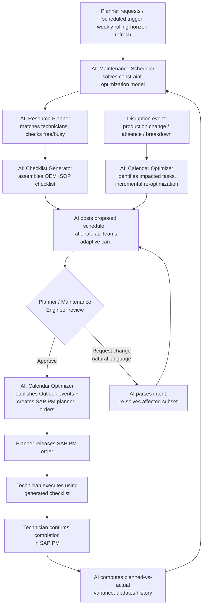

# Business Process: Preventive Maintenance Planning

## Current-State Process

Today, preventive maintenance scheduling is a manual, spreadsheet-and-memory-driven process performed on a weekly or monthly cadence by the Maintenance Planner, with limited visibility into either real-time equipment runtime or the production schedule beyond what is verbally communicated in shift handover meetings. The process is reactive to whatever information happens to be at hand when the schedule is built, and it is rarely revisited once published unless a breakdown forces a rebuild.

1. The Planner pulls the SAP PM maintenance-plan due list (IP10) for the upcoming period, which is driven by calendar-based or last-known-runtime intervals that are often several weeks stale.
2. The Planner cross-references due assets against a separately maintained spreadsheet of "known" production commitments, typically obtained informally from the Production Scheduler rather than from a live, queryable production plan.
3. The Planner manually estimates which technicians might be available, usually from memory of the roster and recent leave requests, without a systematic free/busy check.
4. The Planner drafts a proposed schedule in a spreadsheet, sequencing tasks largely by due date rather than by any weighted optimization of interval risk, production impact, or workforce balance.
5. The Planner emails or verbally communicates the draft schedule to the Maintenance Engineer and Plant Manager for informal sign-off, often with several back-and-forth rounds to resolve conflicts that were not visible upfront.
6. The Planner manually creates or updates SAP PM work orders for each task and sends technician assignments via email or a printed shift board.
7. Technicians receive a generic OEM checklist (often outdated or the wrong revision) or a plant paper checklist stored in a binder, with no automatic tailoring to the specific interval milestone or recent reliability history of that asset.
8. When a disruption occurs (a production freeze is extended, a technician calls in sick, an asset breaks down), the Planner manually re-derives the affected tasks and re-does steps 2–6 for just that subset, usually under time pressure and without re-checking the full downstream ripple effect on other tasks.
9. Completed work is confirmed in SAP PM after the fact, but variance (planned vs. actual date) is rarely tracked or fed back into future scheduling decisions — the same planning blind spots repeat every cycle.

## Pain Points

- **No live constraint checking:** production windows and technician availability are cross-referenced manually and incompletely, causing scheduled PM visits to be rescheduled or skipped at the last minute (directly reflected in the elevated "Rescheduled" and "Skipped – Production Conflict" rates visible in `pm_schedule_history.csv`).
- **Interval-blind, calendar-driven scheduling:** because runtime data is not live-integrated, assets are serviced on a fixed calendar cadence regardless of actual usage — causing both missed intervals on high-utilization assets and unnecessary servicing on low-utilization ones.
- **No systematic workload balancing:** the same senior/available technicians are repeatedly assigned by habit, while others are under-utilized, without a data-driven view of weekly capacity.
- **Generic, non-traceable checklists:** technicians work from generic or outdated checklists, missing plant-specific safety overlays or asset-specific reliability lessons learned from prior failures.
- **No feedback loop:** planned-vs-actual variance is not systematically analyzed, so the same day-of-week/line patterns that cause reschedules recur cycle after cycle.
- **Re-planning is slow and manual:** a single production-freeze extension can take a Planner most of a day to manually re-thread through the affected schedule, checklist, and technician notifications.

## Future-State Process

The AI assistant is inserted at the schedule-generation, resourcing, checklist-assembly, and disruption-response steps, while the Planner and Maintenance Engineer retain approval authority over every schedule that becomes a live commitment.

1. On a scheduled cadence (e.g., weekly refresh of a rolling 13-week horizon) or on-demand, the Planner requests a schedule from the assistant for a given line, plant, or asset class.
2. **[AI — Maintenance Scheduler]** The assistant pulls live runtime and OEM interval data from SAP PM/SQL Database, production plan and shutdown windows from ERP, and historical compliance patterns from `pm_schedule_history`, then solves the constraint-optimization problem to produce a candidate schedule with a plain-language rationale for every date.
3. **[AI — Resource Planner]** The assistant matches each task to a specific certified, available technician using Outlook Calendar free/busy data and roster/skill data, balancing workload, and flags any task it cannot staff.
4. **[AI — Checklist Generator]** The assistant assembles the OEM- and SOP-grounded checklist for each task, with safety/permit flags and any reliability-driven "do not skip" callouts.
5. The assistant posts the full proposed schedule as a Teams adaptive card to the Maintenance Planner and Maintenance Engineer, including the resource-gap report and rationale for each date.
6. The Planner and Maintenance Engineer review and approve, or request specific changes in natural language via Teams (e.g., "move the chiller service a week later").
7. **[AI — Calendar Optimizer]** On approval, the assistant publishes Outlook Calendar events to the shared maintenance resource calendar and technicians' calendars, and creates the corresponding SAP PM planned work orders (held unreleased pending Planner release).
8. The Plant Manager receives a summary view (schedule compliance forecast, resource utilization, flagged risks) for visibility, without needing to review every individual task.
9. Technicians execute the work using the generated checklist and confirm completion in SAP PM; the assistant automatically computes planned-vs-actual variance and feeds it back into the compliance-pattern model used in step 2 of the next cycle.
10. **[AI — Calendar Optimizer]** When a disruption occurs (production plan change, technician absence, breakdown), the assistant automatically identifies affected tasks, incrementally re-optimizes only the impacted subset, and posts a re-optimization diff card for Planner approval before any calendar/SAP PM write-back.

## Process Flow Diagram

## RACI Table (Future-State Process)

| Activity | Technician | Maintenance Engineer | Planner | Plant Manager | AI Assistant |
|---|---|---|---|---|---|
| Define scheduling policy & constraint priorities | I | C | A | R | C |
| Generate candidate PM schedule | I | I | A | I | R |
| Assign technicians to tasks | C | I | A | I | R |
| Generate task checklists | R (executes) | C | I | I | R (drafts) |
| Approve proposed schedule | I | C | A/R | I | I |
| Approve re-optimization after disruption | I | C | A/R | I | R (proposes) |
| Publish calendar events & PM orders | I | I | A | I | R |
| Release PM work order to shop floor | I | C | A/R | I | I |
| Execute PM task | R | A | I | I | I |
| Confirm completion in SAP PM | R | A | C | I | I |
| Review schedule-compliance KPIs | I | C | R | A | C (generates report) |

*R = Responsible, A = Accountable, C = Consulted, I = Informed*

## Success Metrics / KPIs

| KPI | Illustrative Baseline (Manual Scheduling) | Illustrative Target (AI-Assisted) |
|---|---|---|
| PM Schedule Compliance (tasks completed within planned window) | 55–70% | 88–95% |
| Unnecessary/Over-servicing Rate (PM performed well below OEM interval utilization) | 15–20% of PM events | Under 5% of PM events |
| Overdue-Interval Incidents (assets exceeding OEM interval before service) | 8–12% of assets per quarter | Under 2% of assets per quarter |
| Planner Hours Spent on Manual Schedule Construction/Rework | 15–25% of work week | Under 5% of work week |
| Technician Utilization Variance (spread between busiest and least-utilized technician) | 30–40 percentage points | Under 15 percentage points |
| Time to Re-optimize Schedule After a Disruption | 4–8 hours (manual) | Under 15 minutes (AI-assisted, pre-approval) |
| Unplanned Downtime Attributable to Missed/Delayed PM | 20–30% of unplanned downtime events | 8–12% of unplanned downtime events |

*All baseline and target figures are illustrative, industry-typical ranges for framing expected impact; they must be validated and re-baselined against plant-specific CMMS/SAP PM history during the Discovery phase.*
