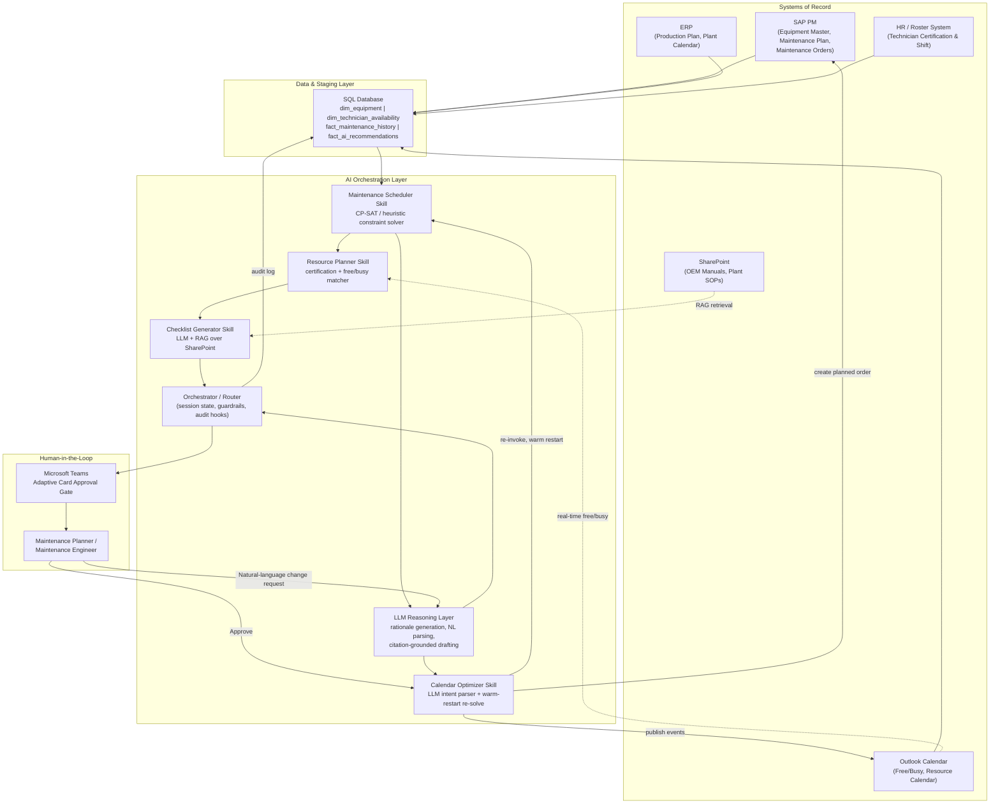

# Technical Design: Preventive Maintenance Planning Assistant

Skills and Connectors referenced throughout this design now follow Claude's real Agent Skills format (`Skills/<skill-name>/SKILL.md`) and MCP connector format (`Connectors/<connector-name>/mcp-server.json` + `tools.json`), rather than the flat, invented-schema markdown files used previously.

## Architecture Overview

The Preventive Maintenance Planning Assistant is architected as a deterministic optimization core wrapped by an LLM orchestration layer, rather than as a pure LLM agent that "decides" schedules by reasoning alone. This split is intentional: PM scheduling is a well-structured combinatorial problem (assets, intervals, calendars, technicians) for which a constraint-programming or heuristic solver gives reproducible, auditable, and provably-constraint-respecting results, while the tasks that genuinely benefit from an LLM — explaining a decision in plain language, retrieving and synthesizing OEM/SOP text into a checklist, and parsing a planner's free-text re-planning request into a structured change — are handled by the LLM layer sitting on top of, not inside, the solver.

Data flows from SAP PM, ERP, and Outlook Calendar into a SQL Database staging layer on a scheduled cadence; the Maintenance Scheduler skill queries that staging layer to build and solve the constraint model; the Resource Planner skill augments the solved schedule with technician assignments; the Checklist Generator skill (LLM + RAG over SharePoint OEM/SOP content) produces task checklists; and the Calendar Optimizer skill (LLM-assisted intent parsing + solver re-invocation) publishes approved schedules and handles re-optimization. A human-in-the-loop approval gate, delivered via Microsoft Teams adaptive cards, sits between every AI proposal and any write-back to SAP PM or Outlook Calendar.

## Architecture Diagram

## Component Breakdown

| Layer | Component | Responsibility |
|---|---|---|
| Orchestration | Orchestrator/Router | Manages skill invocation sequence, session/conversation state for Teams interactions, enforces guardrails (approval gates, citation requirements), writes audit records. |
| Skills | Maintenance Scheduler | Constraint-optimization solve producing the candidate schedule (see Model/AI Approach). |
| Skills | Resource Planner | Certification/availability-based technician assignment and workload balancing. |
| Skills | Checklist Generator | RAG-grounded checklist assembly from OEM manuals and plant SOPs. |
| Skills | Calendar Optimizer | Publish, disruption detection, incremental re-optimization, natural-language re-planning. |
| Connectors | SAP PM, ERP, Outlook Calendar, Microsoft Teams, SQL Database | Data read/write integration per each connector's `SPEC.md`, `mcp-server.json`, and `tools.json` under `Connectors/<connector-name>/`. |
| Data Layer | SQL Database staging tables | `dim_equipment`, `dim_technician_availability`, `fact_maintenance_history`, `fact_ai_recommendations`. |
| Model Layer | Constraint solver (CP-SAT / heuristic) + LLM (rationale, RAG, NL intent parsing) | See Model/AI Approach below. |
| Human-in-the-Loop | Teams adaptive card approval gate | Every schedule publish and every re-optimization requires an approval action before write-back. |

## Data Flow

1. **Nightly/daily batch sync:** SAP PM equipment master and maintenance-plan data, ERP production plan and plant calendar, and HR roster data are extracted into the SQL Database staging tables (`dim_equipment`, `dim_technician_availability`). This mirrors the schema in `Sample Data/equipment_runtime.csv` and `Sample Data/technician_availability.csv`.
2. **Schedule request:** A Planner triggers a schedule generation (on-demand via Teams command, or on the weekly rolling-horizon schedule trigger). The Orchestrator invokes the Maintenance Scheduler skill with the requested scope (plant/line/asset class) and horizon.
3. **Constraint model build & solve:** The Maintenance Scheduler skill queries `dim_equipment` for due-list candidates, `erp_production_plan`/`Plant Calendar` (staged from ERP) for hard-constraint windows, and `fact_maintenance_history` for soft-constraint learning signals, then builds and solves the CP-SAT model (see Model/AI Approach).
4. **Resource matching:** The Resource Planner skill takes the solved task list, filters `dim_technician_availability` by certification and roster availability, then confirms real-time free/busy directly against the Outlook Calendar connector before finalizing assignments.
5. **Checklist assembly:** The Checklist Generator skill performs RAG retrieval over the SharePoint OEM manual and SOP corpus, keyed by equipment model/serial and task-interval milestone, and assembles the cited, sequenced checklist.
6. **Rationale generation:** The LLM reasoning layer converts each task's constraint-solver trace into a plain-language rationale string, strictly grounded in the actual constraint values (no free-form invention of reasons).
7. **Approval gate:** The Orchestrator posts the full proposed schedule (tasks, assignments, checklists, rationale, resource-gap report) as a Teams adaptive card to the Planner/Maintenance Engineer.
8. **Write-back:** On approval, the Calendar Optimizer skill writes Outlook Calendar events (shared resource calendar + technician calendars) and creates SAP PM planned maintenance orders (status: Planned, Unreleased). All write-backs are logged to `fact_ai_recommendations`/audit tables in the SQL Database.
9. **Disruption/re-planning loop:** Disruption events (ERP change events, SAP PM breakdown notifications, Teams leave notifications) or planner natural-language requests trigger the Calendar Optimizer to re-invoke the Maintenance Scheduler/Resource Planner scoped only to impacted tasks (warm restart), producing a diff that re-enters the approval gate at step 7.
10. **Feedback loop:** SAP PM order confirmations (actual completion date, technician, duration) flow back into `fact_maintenance_history`, updating the compliance-pattern data the next scheduling cycle's soft constraints learn from.

## Model/AI Approach

This use case's AI approach is deliberately a **hybrid of deterministic constraint optimization and LLM reasoning**, not an end-to-end LLM scheduler:

**1. Constraint-based schedule optimization (the scheduling decision itself).**
- The core problem is modeled as a **constraint satisfaction/optimization problem (CSP/CP)**, implemented with a CP-SAT-style solver (e.g., Google OR-Tools CP-SAT) for horizons up to roughly 500–800 tasks, where solve times remain within the NFR-1 budget (5 minutes for a full 13-week/plant-wide horizon).
  - **Decision variables:** for each due/near-due PM task, an integer variable representing the scheduled date (encoded as an offset from horizon start) and a binary variable per candidate technician representing assignment.
  - **Hard constraints:** (a) no task inside an ERP production-plan window for its line, unless flagged production-permissible; (b) no task on an unavailable plant-calendar day, unless designated to exploit a shutdown; (c) task completion date ≤ the date the asset's `interval_utilization` would reach 100% at its current runtime-accrual rate; (d) assigned technician holds the required certification and has no calendar conflict; (e) no technician exceeds daily/weekly labor-hour ceilings without an overtime flag.
  - **Soft constraints (weighted objective terms):** workload smoothing across the horizon (penalize weeks exceeding 80% of technician-hour capacity); preference for historically low-reschedule-rate days/lines (learned from `fact_maintenance_history`); task batching for co-located assets to minimize repeated line-access downtime; preference for day-of-week patterns historically associated with on-time completion for that asset class.
  - **Objective:** minimize the weighted sum of soft-constraint penalties subject to all hard constraints being satisfied; if infeasible within the time budget, relax soft constraints in the documented priority order (workload smoothing → day-of-week preference → batching preference) and re-solve, per NFR-2.
- For horizons where task count exceeds the CP-SAT practical solve-time envelope (very large multi-plant runs), the same constraint formulation is solved with a **genetic/heuristic scheduler** (population-based search over schedule permutations, fitness = negative weighted penalty, mutation = single-task date/technician reassignment) as a scalability fallback — same hard/soft constraint definitions, different solve mechanism, so behavior remains consistent regardless of which solver executes.
- **Why this approach over pure ML/LLM scheduling:** the constraints here are largely combinatorial and rule-based (an interval deadline is a hard fact, not a probabilistic inference), and stakeholders (auditors, Planners, Plant Managers) require a schedule whose "why" is a reproducible constraint trace rather than an LLM's post-hoc, potentially inconsistent justification. A solver also guarantees hard-constraint satisfaction, which an LLM cannot guarantee by construction.

**2. LLM reasoning layer (explanation, retrieval, and natural-language interaction).**
- **Rationale generation:** the LLM is given the solver's constraint trace (which hard constraint bound the date, which soft-constraint terms were active) as structured input and generates a one-to-two-sentence plain-language explanation. The LLM is explicitly prohibited from introducing any constraint or fact not present in the trace (see Guardrails), making this a constrained summarization task rather than open-ended reasoning.
- **Checklist generation (RAG):** the Checklist Generator skill uses retrieval-augmented generation over a vectorized SharePoint corpus of OEM manuals and plant SOPs, retrieving the specific manual section for the equipment's model/serial and interval milestone, then having the LLM synthesize a sequenced, cited checklist (see Checklist Generator skill spec for full processing logic).
- **Natural-language re-planning:** planner free-text requests submitted via Teams are parsed by the LLM into a structured intent object (scope: line/asset/date range; action: shift/exclude/prioritize/cancel), which is then applied as a temporary modification to the constraint model's feasible-date domain before re-solving — the LLM never directly emits a schedule; it only emits a structured modification that the deterministic solver then applies and validates against all hard constraints.

**3. Failure-mode isolation.** Because the solver and the LLM have cleanly separated responsibilities, a hallucination in the LLM layer (e.g., a wrong wording in a rationale) cannot cause an infeasible or unsafe schedule to be published — the schedule itself is always solver-validated against hard constraints independent of what the LLM says about it.

## Skills Design

| Skill | Inputs | Processing Approach | Outputs | Failure Modes |
|---|---|---|---|---|
| Maintenance Scheduler | Equipment runtime/intervals, production plan, plant calendar, PM history | CP-SAT/heuristic constraint optimization | Candidate task list with rationale trace, exception report | Infeasible model (handled via soft-constraint relaxation); stale ERP cache (handled via 48-hr staleness guard) |
| Resource Planner | Scheduler output, technician roster, Outlook free/busy | Certification filter + free/busy check + workload-balancing heuristic | Technician assignments, resource-gap report | No certified technician available (surfaced, not silently dropped); roster/calendar disagreement (calendar wins) |
| Checklist Generator | Scheduled task, equipment master, SharePoint OEM/SOP corpus, failure history | RAG retrieval + LLM synthesis with citation enforcement | Sequenced, cited checklist with safety flags | Manual not retrievable with confidence (flagged "Unverified — Generic Template"); missing citation (blocked from publish) |
| Calendar Optimizer | Resourced task list, Outlook/Teams state, disruption events, NL requests | Rule-based publish/conflict-check + warm-restart re-solve + LLM intent parsing | Published calendar events, SAP PM planned orders, re-optimization diffs | Double-booking (auto-retry next slot, then escalate); low-confidence NL parse (clarifying question, no silent execution) |

## Connector Integration Summary

Each connector is implemented as a real MCP server: the canonical narrative spec lives in `Shared-Library/Connectors/`, this use case's adapted spec plus its client-side MCP server declaration and tool manifest live in `Connectors/<connector-name>/` (`SPEC.md`, `mcp-server.json`, `tools.json`).

| Connector | Canonical Spec | Local Connector Folder | Access Mode | Primary Use in This Design |
|---|---|---|---|---|
| SAP PM | `Shared-Library/Connectors/SAP-PM.md` | `Connectors/sap-pm/` | Read/Write | Equipment master, maintenance plan intervals (read); planned order creation and completion confirmation retrieval (write/read) |
| ERP | `Shared-Library/Connectors/ERP.md` | `Connectors/erp/` | Read-only | Production plan windows and plant calendar as hard-constraint input |
| Outlook Calendar | `Shared-Library/Connectors/Outlook-Calendar.md` | `Connectors/outlook-calendar/` | Read/Write | Technician free/busy (read); PM schedule event publish (write) |
| Microsoft Teams | `Shared-Library/Connectors/Microsoft-Teams.md` | `Connectors/microsoft-teams/` | Read/Write (bot) | Approval-gate adaptive cards, re-optimization notifications, NL re-planning intake |
| SQL Database | `Shared-Library/Connectors/SQL-Database.md` | `Connectors/sql-database/` | Read (all skills) / Write (audit + recommendation tables only) | Staging layer for constraint-model inputs; audit and recommendation log |

## Security & Governance

- **Auth model:** each connector uses its own scoped service-principal/OAuth 2.0 credential as defined in its canonical spec (e.g., `SVC_AI_MAINT` for SAP PM, Azure AD app permissions for Outlook/Teams); no shared "god" credential spans connectors.
- **Data residency:** all data remains within the customer's designated SAP/ERP/Azure tenancy boundary; the SQL Database staging layer is provisioned within the same region/residency zone; only short-lived, encrypted context is held in LLM working memory during a request.
- **Audit logging:** every schedule proposal, rationale, approval/rejection, override, and write-back is logged to an immutable audit table with actor, timestamp, and payload hash (NFR-4).
- **Human-in-the-loop gates:** no write-back to SAP PM or Outlook Calendar occurs without a logged human approval (NFR-5); Critical-criticality interval breaches always escalate (FR-15) rather than auto-resolving.
- **Role-based access:** Technicians see only their own assignments/checklists; Planners/Engineers see and approve plant/line schedules; Plant Managers see summary KPIs only (NFR-8), enforced at the Orchestrator layer via role claims propagated from the identity provider.

## Scalability & Performance Targets

- Full-horizon (13-week), plant-wide schedule generation (up to 2,000 in-scope assets): under 5 minutes (NFR-1).
- Incremental disruption-triggered re-optimization: under 60 seconds for the impacted subset.
- Outlook free/busy checks: under 2 seconds per technician per slot (per canonical connector spec).
- SAP PM planned-order write-back: synchronous, confirmed within 5 seconds (per canonical connector spec).
- Horizontal scaling: the constraint solver runs as a stateless worker pool that can be scaled per concurrent plant/line request; the heuristic solver fallback activates automatically above the task-count threshold where CP-SAT solve time would breach the NFR-1 budget.

## Error Handling & Fallback Strategy

- **Solver infeasibility:** relax soft constraints in documented priority order and re-solve (NFR-2); if still infeasible after full relaxation, escalate the specific unresolvable asset(s) to a human Planner with the blocking hard constraint identified.
- **Stale ERP data:** if the staging cache exceeds 48 hours old, block automatic publication and surface a warning requiring Planner confirmation of current production plan (per ERP connector spec).
- **Calendar conflicts:** auto-retry up to 3 alternative slots via solver re-invocation before escalating to a human planner (per Outlook Calendar connector spec).
- **RAG retrieval failure/low confidence:** checklist marked "Unverified — Generic Template Used" rather than fabricating OEM-specific values (per Checklist Generator skill guardrails).
- **Connector outage:** circuit-breaker pattern per connector; scheduling requests queue and retry with exponential backoff; if SAP PM or ERP is unavailable beyond a defined threshold, the Orchestrator notifies the Planner via Teams rather than silently failing.
- **Low-confidence NL intent parse:** the Calendar Optimizer's LLM layer asks a clarifying question rather than executing an ambiguous re-planning request (NFR-9).
