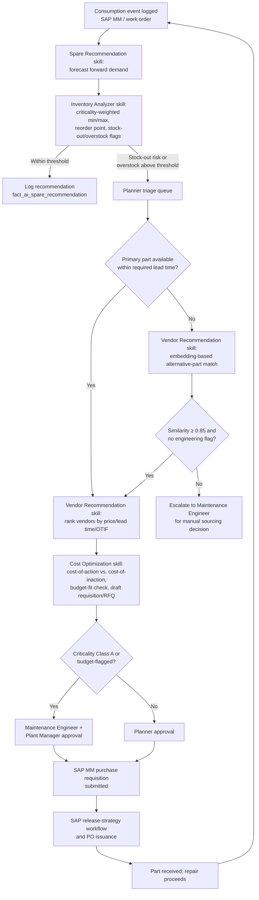

# Business Process: Spare Parts Intelligence Assistant

## Current-State Process (Manual)

Today, spare-parts stocking and procurement is a largely manual, calendar- and memory-driven process. Min/max levels in SAP MM are set once during initial provisioning or during an annual review, and rarely revisited unless a stock-out forces the issue. Consumption is not systematically forecast; planners rely on a rough sense of "how often this breaks" built from experience and informal notes. Vendor selection for routine reorders often defaults to whichever vendor is already set up in the system, rather than being re-evaluated for price, lead time, or delivery reliability. Alternative parts are identified, if at all, by a technician's personal knowledge of cross-brand equivalents, discovered mid-repair under time pressure.

1. A technician pulls a part for a work order; SAP MM stock decrements.
2. Stock falls below the static reorder point (or, more often, is discovered low or absent when a technician goes to the bin during an active repair).
3. If discovered proactively, a planner manually checks SAP MM stock and the vendor master, and raises a purchase requisition based on the existing min/max — without re-evaluating whether that min/max still reflects actual consumption trends.
4. If discovered reactively (mid-repair stock-out), the technician escalates to the planner or buyer, who scrambles to identify a vendor who can expedite delivery, often accepting a price/lead-time premium out of necessity.
5. If the primary part is unavailable from any vendor in time, the technician or engineer searches manuals, prior work orders, or calls colleagues to identify a possible substitute — with no systematic cross-reference and no dimensional/compatibility validation beyond personal judgment.
6. The buyer manually drafts and submits the purchase requisition in SAP MM, writing justification text from memory or from a brief conversation with the requester.
7. The requisition proceeds through SAP's standard approval workflow; once approved, the PO is issued and the part is received, and the repair (if it was blocked on the part) resumes.
8. Periodically (often annually, sometimes never), someone reviews aggregate inventory value and flags obviously excessive stock — usually only when a budget review or physical audit surfaces it.

## Pain Points

- **Stock-outs on critical parts:** Static min/max levels do not adapt to shifting consumption trends (e.g., a bearing wearing faster due to increased line speed), so criticality-relevant parts run out precisely when demand has quietly risen.
- **Overstock tying up capital:** Without systematic slow-mover detection, low-criticality parts accumulate well beyond any realistic consumption need, consuming budget and shelf space that could fund better-targeted stocking of critical items.
- **Reactive, not proactive, vendor selection:** Default-vendor reordering misses better price/lead-time/reliability combinations that a systematic comparison would surface.
- **No systematic alternative-part discovery:** Substitute-part knowledge lives in individual technicians' heads, so a stock-out on a part with a perfectly good cross-brand equivalent still causes downtime if the right person isn't on shift.
- **Manual, inconsistent requisition justification:** Buyers write justification text ad hoc, making downstream audit and pattern analysis (which parts, which reasons, how often) difficult.
- **Delayed repairs:** Every one of the above compounds into extended MTTR whenever a repair is blocked on a part that should have been on the shelf.

## Future-State Process (AI-Assisted)

The Spare Parts Intelligence Assistant is inserted at the forecasting, inventory-policy, sourcing, and requisition-drafting steps — the analytical and drafting work that is currently manual, inconsistent, or simply skipped — while leaving procurement approval and PO release firmly in human hands.

1. **(AI)** The Spare Recommendation skill continuously forecasts forward consumption per material/plant from `fact_consumption` history, incorporating upstream failure-prediction signals where available.
2. **(AI)** The Inventory Analyzer skill converts the forecast into a criticality-weighted safety stock, reorder point, and min/max recommendation, comparing it against the current SAP MM parameters and flagging stock-out risk or overstock/slow-movers with quantified financial exposure.
3. **(Human — Planner)** Reviews AI-flagged recommendations above the materiality threshold in a daily/weekly triage queue, approving routine changes and escalating criticality-significant ones.
4. **(AI)** For any material approaching or below its reorder point, the Vendor Recommendation skill ranks qualified vendors on price/lead-time/OTIF (criticality-weighted), and — if no vendor can meet the required date, or the primary part has no qualified vendor — runs embedding-based alternative-part matching against the catalog cross-reference, flagging any match that requires engineering sign-off.
5. **(AI)** The Cost Optimization skill quantifies the cost-of-action vs. cost-of-inaction trade-off in dollar terms, checks budget fit against the relevant cost center, and drafts the SAP MM purchase requisition (or Supplier Portal RFQ) with a source-cited justification.
6. **(Human — Maintenance Engineer / Plant Manager, criticality-gated)** Reviews and approves the draft requisition/RFQ for Class A materials or budget-flagged actions; routine Class B/C actions are approved by the Planner.
7. **(System — SAP MM)** The approved requisition proceeds through SAP's standard release-strategy approval workflow; the buyer of record issues the PO.
8. **(Human — Technician)** Receives the part and completes the repair without a stock-out-driven delay; consumption is logged back into `fact_consumption`, closing the loop for the next forecast cycle.
9. **(AI)** Every recommendation — actioned or not — is logged to `fact_ai_spare_recommendation` for audit and for measuring forecast accuracy against actual consumption over time.

## Process Flow Diagram

## RACI Table (Future-State Process)

| Process Step | Technician | Maintenance Engineer | Planner | Plant Manager | Procurement / Buyer | AI Assistant |
|---|---|---|---|---|---|---|
| Consumption logging | R | I | I | I | I | I |
| Demand forecasting | I | I | I | I | I | R/A |
| Inventory policy computation (min/max, reorder point) | I | C | A | I | I | R |
| Stock-out / overstock flag triage | I | C | R/A | I | I | R |
| Vendor ranking & alternative-part matching | I | C | I | I | C | R/A |
| Engineering sign-off on flagged substitutes | I | R/A | I | I | I | C |
| Cost-of-action vs. inaction analysis | I | I | C | C | C | R/A |
| Requisition/RFQ drafting | I | I | I | I | I | R |
| Requisition approval (Class B/C, in-budget) | I | I | R/A | I | I | C |
| Requisition approval (Class A or budget-flagged) | I | C | I | R/A | C | C |
| PO issuance | I | I | I | I | R/A | I |
| Part receipt & repair execution | R/A | C | I | I | I | I |

*R = Responsible, A = Accountable, C = Consulted, I = Informed.*

## Success Metrics / KPIs

| KPI | Illustrative Baseline (Reactive/Static Stocking) | Illustrative Target (AI-Assisted) | Notes |
|---|---|---|---|
| Critical-part stock-out rate | 8-15% of critical-part requests | Under 3% | Industry MRO benchmarking; validate against plant stock-out log during Discovery. |
| Inventory carrying cost as % of MRO inventory value | 20-25%/year, with 20-30% of value in slow-moving/obsolete stock | 12-18%/year, slow-mover share under 12% | Driven by systematic overstock detection and disposition. |
| MTTR impact from parts unavailability | 2-5x baseline MTTR when a stock-out blocks repair | Under 1.2x baseline MTTR | Measures the specific delay attributable to parts, isolable via work-order hold-reason codes. |
| Emergency/expedited procurement spend as % of total spares spend | 15-25% | Under 8% | Reduced via proactive forecasting and reorder-point discipline. |
| Requisition cycle time (flag to submission) | 2-5 business days (manual drafting/routing) | Under 4 business hours for pre-approved-vendor, in-budget cases | AI drafting plus criticality-gated approval routing. |
| Forecast accuracy (MAPE, 3-month horizon) | Not systematically measured | Under 25% MAPE for Class A/B parts with 12+ months of history | New metric enabled by the AI layer; tracked in `fact_ai_spare_recommendation` vs. actuals. |

These are directional, industry-typical ranges intended to frame expected improvement — actual baselines must be established from plant-specific stock-out logs, inventory valuation, and MTTR/downtime data during the Discovery phase (see `Implementation Guide.md`).
