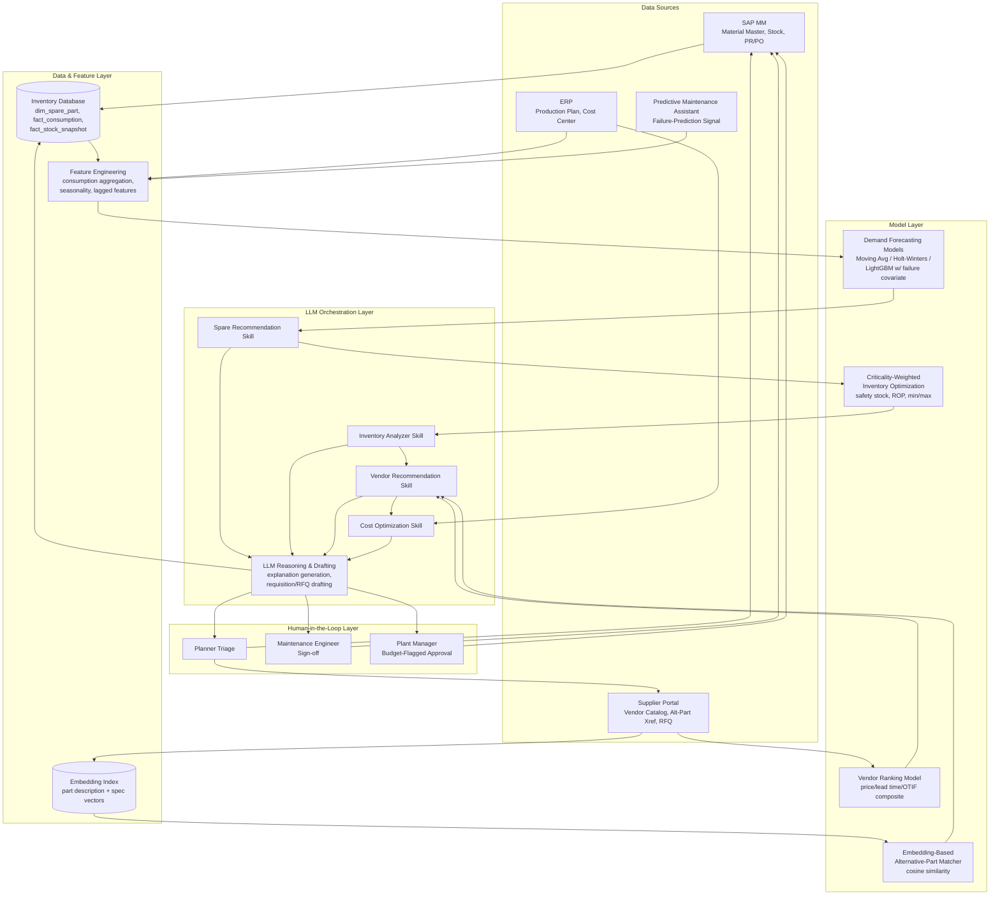

# Technical Design: Spare Parts Intelligence Assistant

## Architecture Overview

The Spare Parts Intelligence Assistant is a layered plugin composed of four connector integrations, a shared data/feature layer, a model layer specific to spare-parts analytics, an LLM orchestration layer that sequences the four skills and generates natural-language outputs, and a human-in-the-loop approval layer that gates every write-back. The design deliberately separates "analysis and recommendation" (which the AI does autonomously and continuously) from "commitment of spend or change to a system of record" (which always requires a human decision), mirroring the connector-level read/write boundaries defined in `Connectors/`.

The Skills and Connectors referenced throughout this document now follow Claude's real Agent Skills (`Skills/<skill-name>/SKILL.md`) and MCP connector (`Connectors/<connector-name>/mcp-server.json` + `tools.json`) formats, rather than the earlier invented schema.

Batch-oriented work (nightly consumption sync, full-plant criticality re-scoring, monthly cost-center reconciliation) runs on a scheduled cadence and populates the Inventory Database's recommendation audit table. On-demand work (a planner asking "what's the alternative for material X," a triggered stock-out alert) runs synchronously through the same skill logic against the latest cached or live data, per the latency targets in `Business Requirements.md` (NFR-1).

## Architecture Diagram

## Component Breakdown

| Layer | Component | Responsibility |
|---|---|---|
| Orchestration | Skill sequencer | Chains Spare Recommendation → Inventory Analyzer → Vendor Recommendation → Cost Optimization for the scheduled batch cycle; supports direct entry to any skill for on-demand queries. |
| Skills | Spare Recommendation, Inventory Analyzer, Vendor Recommendation, Cost Optimization | See `Skills/<skill-name>/SKILL.md` for full specs (real Agent Skill format); each is a bounded unit with defined inputs/outputs/guardrails. |
| Connectors | SAP MM, Inventory Database, ERP, Supplier Portal | See `Connectors/<connector-name>/` (`SPEC.md`, `mcp-server.json`, `tools.json` — real MCP format) for canonical-adapted specs and tool contracts; enforce read/write authorization boundaries. |
| Data Layer | Inventory Database staging tables, feature engineering jobs | Cleans and aggregates raw consumption/stock data into model-ready features; excludes data-quality-flagged records. |
| Model Layer | Forecasting models, inventory-optimization logic, embedding index, vendor ranking model | Purpose-built quantitative models described in "Model/AI Approach" below. |
| Human-in-the-Loop | Approval routing engine | Determines approval tier (Planner / Maintenance Engineer / Plant Manager) from criticality class and budget-fit outcome; blocks write-back until logged approval is received. |

## Data Flow

1. **Nightly batch sync:** SAP MM material master and consumption/stock data sync into the Inventory Database (`dim_spare_part`, `fact_consumption`, `fact_stock_snapshot`), per the Inventory Database connector's integration pattern.
2. **Feature engineering:** The feature layer aggregates `fact_consumption` into monthly series per `material_id`/`plant`, computes trailing volatility (standard deviation) for safety-stock calculation, and pulls the ERP production-plan covariate and any available Predictive Maintenance Assistant failure-prediction signal.
3. **Forecasting (Spare Recommendation skill):** The tiered model selection (see Model/AI Approach) produces a point forecast and prediction interval per material/plant, written alongside the recommendation to `fact_ai_spare_recommendation`.
4. **Inventory optimization (Inventory Analyzer skill):** Consumes the forecast plus `dim_spare_part` criticality class to compute safety stock, reorder point, and min/max; compares to current SAP MM parameters and flags stock-out risk or overstock.
5. **Vendor/alternative-part resolution (Vendor Recommendation skill):** For any flagged material requiring procurement, queries the Supplier Portal's vendor catalog live; if no vendor meets the required date, queries the embedding index (built from `alt_part_xref.csv`-equivalent Supplier Portal data) for alternative-part candidates.
6. **Cost analysis and drafting (Cost Optimization skill):** Combines the inventory flag, vendor shortlist, and ERP cost-center data to quantify cost-of-action vs. cost-of-inaction, checks budget fit, and drafts the SAP MM purchase requisition or Supplier Portal RFQ payload.
7. **LLM explanation layer:** At each skill boundary, the LLM reasoning layer converts structured model output into a grounded natural-language rationale, constrained to cite only records present in the pulled dataset (retrieval-grounded generation, not free generation).
8. **Human approval routing:** The drafted requisition/RFQ, with its rationale, is routed to the criticality/budget-determined approval tier; on approval, the write-back executes via the SAP MM or Supplier Portal connector.
9. **Feedback loop:** Actual subsequent consumption and the outcome of the recommendation (actioned, modified, rejected) flow back into `fact_ai_spare_recommendation` and the next forecast cycle, supporting the forecast-accuracy KPI (MAPE) tracked in `Business Process.md`.

## Model / AI Approach

This use case's AI approach is deliberately layered rather than a single model, because spare-parts consumption spans a wide range of demand patterns (from high-volume regular consumables to single-digit-per-year capital spares) that no single forecasting technique handles well:

- **Demand forecasting (tiered by data volume and criticality):**
  - *Low-volume, intermittent-demand parts* (most Class A capital spares — motors, gearboxes, VFDs): weighted moving average with a manual seasonality override, since classical statistical models (ARIMA, exponential smoothing) overfit and produce unstable intervals on sparse, intermittent series. Croston's method is used as a fallback for materials with long stretches of zero consumption between events.
  - *Moderate/high-volume, regular-cadence consumables* (filters, belts, grease, fuses, gaskets): Holt-Winters (triple exponential smoothing) capturing level, trend, and seasonality — validated against the observed seasonal patterns in `Sample Data/consumption_history.csv` (e.g., summer uptick in `SP-BELT-A-42` and `SP-FILT-AIR-STD`).
  - *Parts with an available upstream failure-prediction signal:* a LightGBM gradient-boosted regressor trained on lagged consumption features (1/3/6-month lags, rolling mean/std) plus the Predictive Maintenance Assistant's equipment-level failure probability and remaining-useful-life estimate as exogenous features — allowing an anomaly-driven failure signal to shift the forecast ahead of the historical trend alone catching up. This is the primary mechanism for cross-use-case value capture between the Predictive Maintenance Assistant and this plugin.
  - Model selection, retraining cadence, and champion/challenger evaluation are managed centrally; each material/plant series is periodically re-evaluated for the appropriate tier as its data volume grows.

- **Criticality-weighted inventory optimization:** Classical inventory-science formulas — `Safety Stock = Z(service_level) × σ_demand_during_lead_time × criticality_multiplier`, `Reorder Point = (avg daily demand × lead_time_days) + Safety Stock` — parameterized by a criticality-to-service-level mapping (Class A: 98% service level, 1.5x multiplier; Class B: 95%, 1.2x; Class C: 90%, 1.0x, as detailed in `Skills/inventory-analyzer/SKILL.md`). This is a transparent, auditable formula-based approach rather than a black-box model, which is intentional: inventory-policy recommendations must be explainable to a plant manager without appeal to model internals.

- **Embedding-based alternative-part matching:** Part descriptions and structured spec attributes (dimensions, ratings, material) from both the internal SAP MM material master and the Supplier Portal's vendor catalog/cross-reference data are embedded using a text-embedding model (e.g., an enterprise-approved embedding endpoint consistent with the organization's model-serving environment). Candidate matches are retrieved via cosine similarity against the embedding index; only matches at or above a 0.85 similarity threshold are surfaced, and any match carrying a vendor-noted compatibility caveat (reprogramming, firmware, dimensional verification) is flagged as requiring human engineering sign-off regardless of similarity score. This combines semantic matching (catching cross-brand/cross-terminology equivalents that keyword search would miss) with a hard compatibility gate that prevents the model from over-trusting a high similarity score on a functionally non-trivial substitution.

- **LLM reasoning and drafting layer:** A large language model sits above the quantitative outputs of all four skills, performing three functions: (1) translating structured model output into a plain-language, source-cited rationale (retrieval-grounded — the model is given only the specific records used and instructed not to introduce unsupported claims); (2) drafting purchase requisition and RFQ text in the format required by the SAP MM and Supplier Portal connectors; and (3) answering on-demand natural-language queries from planners/engineers (see `Prompt Library.md`) by routing the query to the appropriate skill and data source rather than answering from general knowledge.

## Skills Design

| Skill | Inputs | Processing Approach | Outputs | Key Failure Modes |
|---|---|---|---|---|
| Spare Recommendation | Consumption history, material master, stock position, optional failure-prediction signal, ERP production plan | Tiered forecasting model selection; delta check against current SAP MM parameters | Forecast + interval, recommended min/max delta, grounded rationale | Insufficient history (labeled low-confidence, not suppressed); stale ERP production-plan cache (flagged, not silently used). |
| Inventory Analyzer | Forecast, material master, stock snapshot, consumption variability | Criticality-weighted safety stock/ROP/min-max formula; stock-out and overstock detection with carrying-cost quantification | Computed policy, stock-out/overstock flags, dollar-quantified carrying cost | Snapshot staleness beyond 24h (triggers live SAP MM read); criticality class missing (defaults to Class B with a flag). |
| Vendor Recommendation | Vendor catalog, alt-part cross-reference, material master, required qty/date | Multi-criteria vendor scoring; embedding-based alt-part matching with compatibility gate | Ranked vendor shortlist, alt-part candidates with sign-off flag, draft RFQ | No qualified vendor and no confident alt-part match (escalates to manual sourcing, does not fabricate an option); ERP/Supplier Portal price divergence (surfaced, not resolved silently). |
| Cost Optimization | Inventory flag, vendor shortlist, cost-center budget, historical stock-out impact | Cost-of-action vs. cost-of-inaction quantification; budget-fit check; requisition drafting | Dollar comparison, budget-fit statement, draft requisition/RFQ with approval-tier tag | Budget-flagged item (escalates rather than blocks); missing historical downtime data (uses industry-illustrative benchmark, clearly labeled). |

## Connector Integration Summary

| Connector | Canonical Spec | Access Mode | Primary Use in This Plugin |
|---|---|---|---|
| SAP MM | `Shared-Library/Connectors/SAP-MM.md` | Read (material master, stock) / Write (purchase requisition only) | System of record grounding for all recommendations; requisition write-back after human approval. |
| Inventory Database | `Shared-Library/Connectors/Inventory-Database.md` | Read (consumption, stock snapshot, spare part master) / Write (recommendation audit log only) | Analytical backbone for forecasting and criticality scoring; audit trail of every recommendation. |
| ERP | `Shared-Library/Connectors/ERP.md` | Read-only | Production-plan demand covariate; cost-center budget-fit checking. |
| Supplier Portal | `Shared-Library/Connectors/Supplier-Portal.md` | Read (catalog, alt-part xref) / Write (RFQ submission only) | Live vendor comparison; alternative-part cross-reference source; RFQ drafting. |

## Security & Governance

- **Auth model:** Each connector uses its canonical OAuth 2.0 client-credentials or managed-identity pattern (per `Connectors/`), with the plugin's service accounts scoped to the minimum necessary read/write boundary — no connector grants this plugin PO release, financial posting, or physical stock-adjustment authority.
- **Data residency:** All consumption, stock, and vendor data processed by this plugin, including any staging/feature tables used for model inference, remain within the deploying plant's designated regional data boundary (NFR-5).
- **Audit logging:** Every recommendation (actioned or not), every human approval/rejection decision, and every write-back is logged with timestamp, user, and model version, retained per the organization's procurement records-retention policy (NFR-7).
- **Human-in-the-loop gates:** No write action (requisition creation, RFQ submission) executes without a logged human approval, routed to the tier determined by criticality class and budget-fit outcome (Planner / Maintenance Engineer / Plant Manager).
- **Explainability:** Every numeric recommendation carries a grounded, source-cited rationale (NFR-6); the LLM layer is constrained via retrieval grounding from introducing claims not traceable to pulled source records.

## Scalability & Performance Targets

- On-demand single-material/plant query: under 5 seconds (NFR-1).
- Full-plant batch re-scoring (forecast + inventory policy for the full active material catalog): under 30 minutes per plant (NFR-1).
- Designed to scale horizontally across plants by parameterizing all skill invocations on `plant`; no cross-plant shared state beyond the multi-plant vendor catalog and embedding index, which are refreshed independently of plant-specific batch cycles.
- Embedding index refresh (as vendor catalogs and cross-references change) runs on a daily cadence, decoupled from the material-level forecasting cycle.

## Error Handling & Fallback Strategy

- **Connector unavailability:** Any of the four connectors being unreachable triggers a fallback to the last-cached data with a visible as-of timestamp (per each connector's canonical error-handling pattern), rather than failing the full recommendation pipeline (NFR-9).
- **Insufficient data:** Materials with fewer than 3 historical consumption events are forecast with an explicit "low-confidence — insufficient history" label rather than suppressed or given a false-precision estimate.
- **No confident alternative-part match:** Below the 0.85 similarity threshold, the system states "no confident alternative found — recommend manual sourcing" rather than presenting a weak match as a recommendation.
- **Conflicting source data:** Where ERP and live Supplier Portal pricing/lead-time diverge materially, both figures are surfaced rather than one being silently preferred.
- **Approval timeout:** Draft requisitions/RFQs awaiting approval beyond a configurable SLA (default 48 hours for Class A stock-out-risk items) trigger an escalation reminder to the assigned approver and, if still unactioned, to their manager — the plugin never auto-escalates to a write action on timeout.
